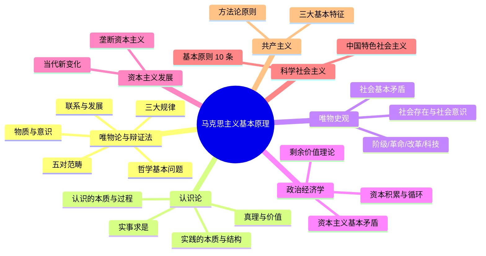

# 马克思主义原理 — 知识体系大纲

> 来源：2023 版统编教材 · 重点章节整理
> 格式：Tee1337 风格（编号层级 + 星级标注 + 精炼定义/要点展开）
> 参考：`Attachments/马克思主义原理/originals/马克思主义基本原理_Tee1337.pdf`
> 每节末尾均有 Mermaid mindmap，在 Obsidian 中可直接渲染为思维导图

---

## 📖 知识体系总览

---

## 第一章：世界的物质性及发展规律

📄 **笔记**：`[[Attachments/马克思主义原理/notes/ch1-物质与辩证法]]`

| 节 | 主题 | 核心问题 |
|:---|:-----|:---------|
| 第一节 | 世界的多样性与物质统一性 | 哲学基本问题、列宁物质定义、运动与时空、物质意识关系、AI 局限、世界物质统一性 |
| 第二节 | 事物的普遍联系和变化发展 | 联系四特点、发展实质、对立统一规律、量变质变规律、否定之否定规律、五对范畴 |

---

## 第二章：实践与认识及其发展规律

📄 **笔记**：`[[Attachments/马克思主义原理/notes/ch2-实践与认识]]`

| 节 | 主题 | 核心问题 |
|:---|:-----|:---------|
| 第一节 | 实践与认识 | 科学实践观、实践三特征/三结构/三形式、实践决定认识、认识的两次飞跃 |
| 第三节 | 认识世界和改造世界 | 自由与必然、实事求是、守正创新、理论创新与实践创新良性互动 |

---

## 第三章：人类社会及其发展规律

📄 **笔记**：`[[Attachments/马克思主义原理/notes/ch3-社会存在与发展动力]]`

| 节 | 主题 | 核心问题 |
|:---|:-----|:---------|
| 第一节 | 人类社会的存在与发展 | 社会存在三要素、社会意识、生产力与生产关系、经济基础与上层建筑、社会形态更替 |
| 第二节 | 社会历史发展的动力 | 社会基本矛盾、阶级与阶级斗争、社会革命、改革、科技、文化 |

---

## 第四章：资本主义的本质及规律

📄 **笔记**：`[[Attachments/马克思主义原理/notes/ch4-资本主义本质]]`

| 节 | 主题 | 核心问题 |
|:---|:-----|:---------|
| 第二节 | 资本主义经济制度 | 资本原始积累、劳动力商品、剩余价值（绝对/相对/超额）、资本积累、循环周转、经济危机 |
| 第三节 | 资本主义上层建筑 | 国家职能本质、民主制度、意识形态 |

---

## 第五章：资本主义的发展及其趋势

📄 **笔记**：`[[Attachments/马克思主义原理/notes/ch5-当代资本主义新变化]]`

| 节 | 主题 | 核心问题 |
|:---|:-----|:---------|
| 第二节 | 当代资本主义新变化 | 二战后五大变化及实质、21 世纪四大新特征、大变局下三大矛盾冲突 |

---

## 第六章：社会主义的发展及其规律

📄 **笔记**：`[[Attachments/马克思主义原理/notes/ch6-科学社会主义原则]]`

| 节 | 主题 | 核心问题 |
|:---|:-----|:---------|
| 第二节 | 科学社会主义基本原则 | 十条基本原则、三个方法指导、与中国特色社会主义的关系 |

---

## 第七章：共产主义崇高理想及其最终实现

📄 **笔记**：`[[Attachments/马克思主义原理/notes/ch7-共产主义理想]]`

| 节 | 主题 | 核心问题 |
|:---|:-----|:---------|
| 第一节 | 展望未来共产主义新社会 | 四条方法论原则、按需分配、社会高度和谐、自由全面发展 |

---

> 💡 **学习建议**：第一章（唯物辩证法）和第二章（认识论）是**世界观方法论基础**，第三章（唯物史观）是**历史观核心**，第四至五章是**资本主义批判**，第六至七章是**社会主义与共产主义目标**。
