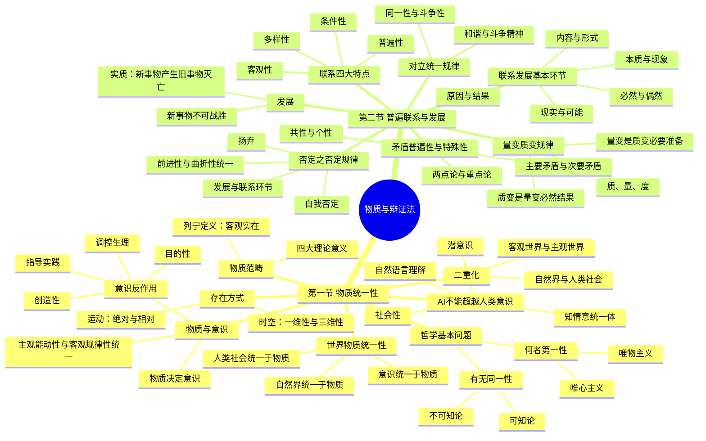

# 第一章 世界的物质性及其发展规律

## 第一节 世界的多样性与物质统一性

### ❓ 问题 1：什么是哲学的基本问题？

✅ **解答**：哲学基本问题是**思维和存在的关系问题**。它包括两个方面：
- **何者第一性**：思维与存在、精神与物质谁是世界本原。主张物质第一性的属于**唯物主义**，主张精神第一性的属于**唯心主义**。
- **有无同一性**：思维能否正确认识存在。主张世界可以认识的属于**可知论**，主张世界不可认识的属于**不可知论**。

---

### ❓ 问题 2：什么是列宁的物质定义？马克思主义物质观有哪些理论意义？

✅ **解答**：列宁指出，**"物质是标志客观实在的哲学范畴"**，这种客观实在是人通过感觉感知的，它不依赖于我们的感觉而存在，为我们的感觉所复写、摄影、反映。

马克思主义物质观的**四大理论意义**：
1. 坚持了唯物主义一元论，同唯心主义一元论和二元论划清界限
2. 坚持了能动的反映论和可知论，批判了不可知论
3. 体现了唯物论与辩证法的统一，克服了形而上学唯物主义的缺陷
4. 体现了唯物主义自然观与历史观的统一，是彻底的唯物主义

---

### ❓ 问题 3：物质的存在方式是什么？

✅ **解答**：物质的存在方式包括**运动**和**时间空间**两个维度。

**运动**是物质的**根本属性**（存在方式）：
- **绝对运动**：世界上一切事物都处于运动变化之中，运动是绝对的、无条件的
- **相对静止**：事物在特定条件下保持质的稳定性，静止是相对的、有条件的
- 物质世界的运动是**绝对运动和相对静止的统一**

**时间与空间**是物质运动的**存在形式**：
- **时间**：物质运动的持续性、顺序性，特点是**一维性**（单向流逝，不可逆转）
- **空间**：物质运动的广延性、伸张性，特点是**三维性**（长、宽、高）
- 时空是客观的，与物质运动不可分割

---

### ❓ 问题 4：如何理解物质世界的二重化？

✅ **解答**：物质世界分化的两大趋势：
- **自然界与人类社会的分化**：自然界是自在存在，人类社会是自为存在，两者既相区别又相联系
- **客观世界与主观世界的分化**：客观世界指不依赖于人的意识而存在的物质世界，主观世界指人的意识、精神世界。主观世界是客观世界的反映，并能反作用于客观世界

---

### ❓ 问题 5：物质与意识的辩证关系是什么？

✅ **解答**：

**物质决定意识**——意识是人脑的机能和属性，是客观世界的主观映像。

**意识反作用于物质**（意识的能动作用，四个表现）：
1. **目的性和计划性**：人的活动是有目的、有计划的
2. **创造性**：意识不仅能反映事物的现象，还能通过思维创造性地反映事物的本质和规律
3. **指导实践改造世界**：意识通过实践把观念的东西转化为现实的东西
4. **调控人的生理活动**：意识、情感能调节和控制人的生理过程

**核心原则**：**主观能动性与客观规律性的统一**——尊重客观规律是正确发挥主观能动性的前提，发挥主观能动性是认识和利用客观规律的条件。

---

### ❓ 问题 6：人工智能为什么不能超越人类意识？

✅ **解答**：AI 不能超越人类意识的**四个根本原因**：
1. **知情意统一体**：人类意识是知（认知）、情（情感）、意（意志）三者的有机统一，AI 只是对认知功能的模拟
2. **社会性**：人类意识是社会劳动的产物，与语言、交往、文化紧密相连，AI 没有真正的社会性
3. **自然语言理解**：AI 无法像人类一样真正理解自然语言的语义和语境，只是基于统计和规则的模式匹配
4. **潜意识**：人类有大量潜意识、直觉、灵感等非理性意识活动，AI 不具备这些

---

### ❓ 问题 7：如何理解世界的物质统一性？

✅ **解答**：世界的真正统一性在于它的**物质性**，体现在三个层面：
- **自然界统一于物质**：自然界先于人类而存在，具有客观实在性
- **人类社会统一于物质**：人类社会是物质世界长期发展的产物，其存在和发展的基础是物质生产
- **意识统一于物质**：意识是物质世界长期发展的产物，是人脑的机能，是对物质世界的反映

**世界物质统一性原理**是马克思主义哲学的基石，是一切从实际出发、实事求是思想路线的哲学基础。

---

## 第二节 事物的普遍联系和变化发展

### ❓ 问题 8：唯物辩证法的总观点和总特征是什么？

✅ **解答**：**联系的观点**和**发展的观点**是唯物辩证法的总观点和总特征。唯物辩证法是关于世界普遍联系和永恒发展的科学。

---

### ❓ 问题 9：联系有哪四大特点？

✅ **解答**：

| 特点 | 内涵 |
|:-----|:-----|
| **客观性** | 联系是事物本身固有的，不以人的意志为转移 |
| **普遍性** | 一切事物都与周围其他事物联系着，世界是相互联系的统一整体 |
| **多样性** | 联系的形式多种多样：直接/间接、内部/外部、本质/非本质、必然/偶然等 |
| **条件性** | 任何联系都以一定条件为中介，条件的改变会引发联系的变化 |

---

### ❓ 问题 10：什么是发展？为什么新事物不可战胜？

✅ **解答**：**发展是前进的、上升的运动**，发展的实质是**新事物的产生和旧事物的灭亡**。

**新事物不可战胜的原因**：
- 新事物符合事物发展的必然趋势，代表着事物发展的方向
- 新事物是在旧事物的"母体"中孕育成熟的，它克服了旧事物中消极、过时的东西，吸收了积极、合理的因素，增添了旧事物所不能容纳的新内容
- 在社会历史领域，新事物符合人民群众的根本利益和要求

---

### ❓ 问题 11：什么是对立统一规律（矛盾规律）？

✅ **解答**：对立统一规律是唯物辩证法的**实质和核心**，揭示了事物发展的**根本动力**。

**矛盾的同一性和斗争性**：
- **同一性**：矛盾双方相互依存、相互贯通、在一定条件下相互转化的性质和趋势
- **斗争性**：矛盾双方相互排斥、相互分离、相互否定的性质和趋势
- 同一性与斗争性**相互联结、相互制约**：同一性离不开斗争性，斗争性寓于同一性之中

**和谐与斗争精神**：
- **和谐**是矛盾双方在一定条件下达到统一、协调的状态，是矛盾同一性在事物发展中的积极作用
- 和谐是相对的、有条件的，**斗争是绝对的、无条件的**

---

### ❓ 问题 12：矛盾的普遍性与特殊性是什么？什么是主要矛盾？

✅ **解答**：

**矛盾的普遍性**（共性）：矛盾存在于一切事物中（事事有矛盾），贯穿于每一事物发展过程的始终（时时有矛盾）

**矛盾的特殊性**（个性）：不同事物的矛盾各有特点，同一事物在不同发展阶段上的矛盾各有特点

**共性与个性的关系**：共性寓于个性之中，个性包含着共性。矛盾的普遍性与特殊性的关系问题是矛盾问题的**精髓**。

**主要矛盾与次要矛盾**：
- **主要矛盾**：在事物发展中处于支配地位、起决定作用的矛盾
- **次要矛盾**：在事物发展中处于从属地位的矛盾

**矛盾主要方面与次要方面**：事物的性质主要由**主要矛盾的主要方面**所规定

**方法论**：**两点论与重点论的统一**——既要全面看问题（两点论），又要抓住主要矛盾和矛盾的主要方面（重点论）

---

### ❓ 问题 13：什么是量变质变规律？

✅ **解答**：

三个核心概念：
- **质**：一事物区别于他事物的内在规定性
- **量**：事物的规模、程度、速度等可以用数量表示的规定性
- **度**：保持事物质的稳定性的数量界限（关节点/临界点），超出度的范围事物就发生质变

**量变与质变的辩证关系**：
- **量变是质变的必要准备**：没有量变的积累，质变就不会发生
- **质变是量变的必然结果**：量变超过度的界限，必然引起质变
- 质变巩固量变成果，**为新量变开辟道路**

量变与质变是**相互渗透**的：总的量变过程中有部分质变，质变过程中有量的扩张。

---

### ❓ 问题 14：什么是否定之否定规律？

✅ **解答**：否定之否定规律揭示了事物发展的**方向和道路**。

**辩证否定观**（四个要点）：
1. **自我否定**：否定是事物的自我否定，是事物内部矛盾运动的结果
2. **发展的环节**：否定是旧事物向新事物的转变，是发展的环节
3. **联系的环节**：否定将新旧事物联系起来，是联系的环节
4. **扬弃**：辩证否定的实质是"扬弃"——既克服又保留，既批判又继承

**事物发展的总趋势**：**前进性与曲折性的统一**——方向是前进的、上升的，道路是迂回的、曲折的。事物发展呈现螺旋式上升或波浪式前进。

---

### ❓ 问题 15：联系和发展的基本环节有哪些？

✅ **解答**：五对基本范畴构成了联系和发展的基本环节：

| 范畴 | 内涵 |
|:-----|:-----|
| **内容与形式** | 内容是构成事物的一切内在要素的总和；形式是内容诸要素的结构和组织方式。内容决定形式，形式反作用于内容 |
| **本质与现象** | 本质是事物的根本性质、内在联系；现象是事物的外部联系和表面特征。本质通过现象表现，现象是本质的外在显现 |
| **原因与结果** | 原因是引起某种现象的现象，结果是被某种现象引起的现象。原因在前，结果在后，两者对立统一、相互转化 |
| **必然与偶然** | 必然是事物发展中确定不移的趋势；偶然是事物发展中不确定的趋势。必然通过偶然为自己开辟道路，偶然背后隐藏着必然 |
| **现实与可能** | 现实是已经实现了的可能；可能是包含在事物中、预示事物发展前途的趋势。现实产生可能，可能在一定条件下转化为现实 |

---

## 思维导图

