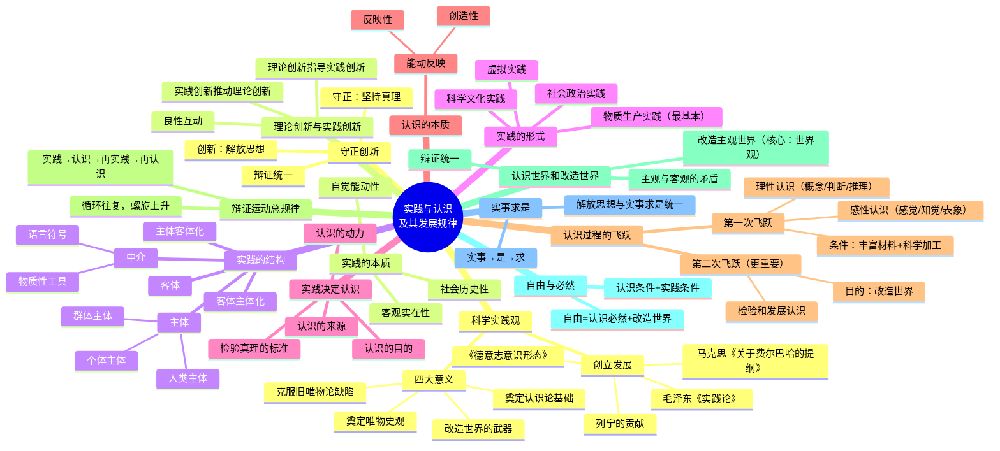

# 实践与认识及其发展规律

> 本章涵盖教材第二章第一节（实践与认识）和第三节（认识世界和改造世界），以问答形式梳理核心知识点。

---

## 一、科学实践观

### ❓ 科学实践观是如何创立和发展的？

✅ 马克思在《关于费尔巴哈的提纲》（"天才世界观萌芽的第一个文件"）中首次提出科学的实践概念，在《德意志意识形态》中进一步系统阐述，确立了"新唯物主义"——实践的唯物主义。列宁进一步阐发了实践在认识中的作用，提出"生活、实践的观点，应该是认识论的首要的和基本的观点"。毛泽东在《实践论》中系统论述了实践与认识的辩证关系，提出"实践、认识、再实践、再认识"的总规律。

### ❓ 科学实践观的创立有什么重大意义？

✅ 四大意义：
1. **克服了旧唯物主义的根本缺陷**：旧唯物主义"不了解'革命的'、'实践批判的'活动的意义"，陷入了形而上学。
2. **奠定了唯物史观的基础**：从实践出发理解社会，揭示了社会生活的实践本质。
3. **奠定了马克思主义认识论的基础**：将实践观点引入认识论，实现了认识论的革命性变革。
4. **提供了改造世界的锐利武器**：马克思主义哲学不仅要解释世界，更要改变世界。

---

## 二、实践的本质与特征

### ❓ 什么是实践？实践有哪些基本特征？

✅ 实践是人类能动地改造世界的社会性的物质活动。三个基本特征：
1. **客观实在性（直接现实性）**：实践是客观的物质活动，其主体、客体、手段和结果都是客观实在的。
2. **自觉能动性**：实践是人有意识、有目的的活动，体现了人的主观能动性。
3. **社会历史性**：实践不是孤立的个人行为，而是在一定社会关系中进行的、受历史条件制约的活动。

---

## 三、实践的基本结构

### ❓ 实践的基本结构由哪些要素构成？

✅ 实践由三个基本要素构成：
- **实践主体**：处于一定社会关系中、从事实践活动的人。分为个体主体、群体主体和人类主体。
- **实践客体**：被纳入实践活动范围、与实践主体发生关系的客观事物。
- **实践中介**：联结主体与客体的各种工具和手段，包括物质性工具（如机器设备）和语言符号（如文字、数据）。

### ❓ 什么是主体客体化和客体主体化？

✅ 这是实践过程中主体与客体相互作用的两个方面：
- **主体客体化**：主体通过实践活动把自己的本质力量（知识、技能、意志等）物化到客体中去，改造客体使之符合人的需要。
- **客体主体化**：客体在实践过程中反过来影响和制约主体，丰富主体的认识、提高主体的能力。

---

## 四、实践的形式

### ❓ 实践有哪些基本形式？

✅ 三大基本形式 + 当代新形式：
1. **物质生产实践**（最基本、最根本的实践形式）：人类改造自然以获取物质生活资料的活动，是社会存在和发展的基础。
2. **社会政治实践**：处理社会关系、改造社会的活动，如政治活动、社会管理、革命斗争等。
3. **科学文化实践**：探索客观规律、创造精神文化成果的活动，如科学实验、艺术创作、教育等。
4. **虚拟实践**：伴随信息技术发展而出现的新形式，在虚拟空间进行的探索性、创造性活动，是现实实践的延伸和补充。

---

## 五、实践对认识的决定作用

### ❓ 实践对认识的决定作用表现在哪些方面？

✅ 实践是认识的基础，对认识起决定作用，具体表现在四个方面：
1. **实践是认识的来源**：一切真知都来源于实践，离开实践的认识是无源之水。
2. **实践是认识发展的动力**：实践不断提出新问题、新要求，推动认识的深化和扩展。
3. **实践是认识的目的**：认识的最终目的是指导实践、改造世界，不为实践服务的认识是空洞的。
4. **实践是检验认识真理性的唯一标准**：只有实践才能证明认识是否正确，别无其他途径。

---

## 六、认识的本质

### ❓ 认识的本质是什么？

✅ 认识的本质是**主体在实践基础上对客体的能动反映**。这一界定包含两层含义：
1. **反映性**：认识是对客观事物的反映，坚持了唯物主义反映论，与唯心主义先验论划清界限。
2. **创造性**：认识不是机械的、被动的反映，而是主体积极的、创造性的建构过程，体现了认识的能动性。

辩证唯物主义认识论既坚持了认识的客观性，又肯定了认识的主体性，是能动的革命的反映论。

---

## 七、认识过程的两次飞跃

### ❓ 什么是认识过程的第一次飞跃？实现需要哪些条件？

✅ **第一次飞跃：从感性认识到理性认识。**

- **感性认识**是认识的初级阶段，包括三种形式：
  - 感觉：对事物个别属性的直接反映
  - 知觉：对事物整体形象的综合反映
  - 表象：回忆和再现过去感知过的事物形象

- **理性认识**是认识的高级阶段，包括三种形式：
  - 概念：对事物本质属性的抽象概括
  - 判断：运用概念对事物进行肯定或否定的思维形式
  - 推理：从已知判断推出新判断的逻辑过程

实现第一次飞跃需要两个条件：
1. **掌握丰富而真实的感性材料**——这只是实现飞跃的基础。
2. **运用科学的思维方法进行加工制作**（去粗取精、去伪存真、由此及彼、由表及里）——这是实现飞跃的关键。

### ❓ 为什么说从认识到实践的飞跃是更重要的一次飞跃？

✅ **第二次飞跃：从理性认识到实践。**

这次飞跃更为重要，原因在于：
1. **认识的目的是改造世界**：理性认识如果不回到实践中去指导行动，就失去了意义。
2. **理性认识只有在实践中才能得到检验和发展**：未经实践检验的认识无法确认其真理性。
3. **实践需要科学理论的指导**：没有理论指导的实践是盲目的实践。

---

## 八、实践与认识的辩证运动总规律

### ❓ 实践与认识的辩证运动总规律是什么？

✅ **"实践、认识、再实践、再认识，这种形式，循环往复以至无穷，而实践和认识之每一循环的内容，都比较地进到了高一级的程度。"**（毛泽东《实践论》）

这一规律揭示了认识发展的总过程：
- 实践与认识是不断循环、螺旋上升的辩证运动
- 每一次循环都在原有基础上提升到更高的水平
- 这是一个永无止境的过程，体现了认识发展的无限性

---

## 九、认识世界和改造世界

### ❓ 认识世界和改造世界是什么关系？

✅ 两者是辩证统一的：
- **认识世界**是为了**改造世界**，改造世界是认识的目的和归宿。
- 改造世界的过程又不断深化对世界的认识。
- 两者统一的基础是**实践**。
- 认识世界和改造世界过程中的基本矛盾是**主观与客观的矛盾**，人类的全部活动就是不断解决这一矛盾的过程。

### ❓ 改造客观世界与改造主观世界的关系是什么？

✅ 人类在改造客观世界的同时，也必须改造自己的主观世界。二者的核心关系：
- **改造客观世界**：改造自然界和人类社会。
- **改造主观世界**：提高认识能力、改造思想方法、树立科学的世界观——**核心是改造世界观**（包括自然观、历史观、人生观、价值观等）。
- 二者是相辅相成的：改造主观世界是为了更有效地改造客观世界，而改造客观世界的实践又推动主观世界的改造。

---

## 十、自由与必然

### ❓ 什么是自由与必然？二者关系如何？

✅ **自由**是马克思主义哲学的重要范畴：
- **必然**（必然性）：自然界和人类社会的客观规律，是不以人的意志为转移的。
- **自由**：不是摆脱客观规律任意妄为，而是**对必然的认识和对客观世界的改造**。

**自由的条件：**
1. **认识条件**：认识和把握客观规律——这是实现自由的前提。
2. **实践条件**：运用客观规律改造世界——必须在实践中才能将认识到的必然转化为现实的自由。

自由不是绝对的，而是历史的、具体的、有条件的。

---

## 十一、一切从实际出发，实事求是

### ❓ 如何理解"一切从实际出发，实事求是"？

✅ 这是马克思主义认识论的根本要求和党的思想路线的核心。
- **"实事"**：客观存在的一切事物。
- **"是"**：客观事物的内部联系即规律性。
- **"求"**：我们去研究、去探索。

**解放思想与实事求是的关系**：
- **解放思想**是实事求是的前提——只有冲破陈旧观念的束缚，才能做到实事求是。
- **实事求是**是解放思想的目的和归宿——解放思想是为了更好地符合客观实际。
- 二者是辩证统一的：离开实事求是，解放思想就会变成主观臆想；离开解放思想，实事求是就会变成因循守旧。

---

## 十二、守正创新

### ❓ 什么是"守正创新"？二者的辩证关系是什么？

✅ **守正创新**是坚持和发展马克思主义的基本原则：
- **守正**：坚持真理，坚守正道。即坚守马克思主义基本原理，遵循客观规律，按客观规律办事。
- **创新**：解放思想，勇于探索。即在坚持正确方向的前提下，大胆探索新问题、新领域，推动理论和实践不断发展。

**二者辩证统一：**
- 守正是创新的**基础和前提**——离开守正，创新就会迷失方向。
- 创新是守正的**目的和动力**——离开创新，守正就会变成僵化教条。
- 在守正中创新，在创新中守正。

---

## 十三、理论创新与实践创新

### ❓ 如何理解理论创新与实践创新的良性互动？

✅ 理论创新与实践创新相互促进、相得益彰：
- **实践创新**是理论创新的**源泉和动力**：实践的发展不断提出需要回答的新课题，推动理论突破。
- **理论创新**是实践创新的**先导和指南**：新的理论成果为实践创新提供科学指导和行动方案。
- 二者形成**良性互动**：实践创新呼唤并催生理论创新，理论创新反过来指导和推动实践创新，如此循环往复，推动认识和实践不断发展。

这是马克思主义永葆生机活力的根本所在。

---

## 思维导图

