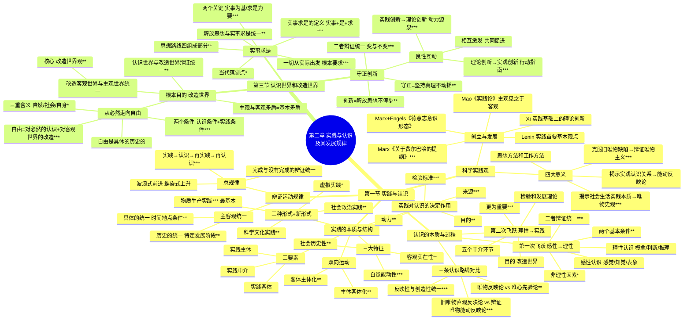

# 第二章 实践与认识及其发展规律

## 第一节 实践与认识

### 一、科学实践观及其意义

#### （一）科学实践观的创立与发展 ***

**定义**：科学实践观是马克思首创的、从主观与客观、主体与客体的统一中把握实践的哲学观点，揭示了实践是人类能动地改造世界的社会性的物质活动。

**创立与发展历程**：
1. **马克思《关于费尔巴哈的提纲》**——"包含新世界观天才萌芽的第一个文件"：
   x 系统论述实践观点，揭示科学实践观的基本内容
   y "从前的一切唯物主义的主要缺点是：对对象、现实、感性，只是从客体的或者直观的形式去理解，而不是把它们当做感性的人的活动，当做实践去理解"
   z "哲学家们只是用不同的方式解释世界，而问题在于改变世界"——提出检验真理的实践标准

2. **马克思、恩格斯《德意志意识形态》**：
   x 物质资料生产是人类历史中首要的社会实践活动——其他一切历史活动得以进行的前提
   y 唯物史观与唯心史观的根本区别：始终站在现实历史的基础上，"从物质实践出发来解释各种观念形态"
   z 强调实践在全部社会生活中的变革作用——"全部问题都在于使现存世界革命化，实际地反对并改变现存的事物"

3. **列宁《唯物主义和经验批判主义》**：
   x 明确提出"生活、实践的观点，应该是认识论的首要的和基本的观点"
   y 阐述了实践基础上认识的辩证运动和发展

4. **毛泽东《实践论》**：
   x 将实践表述为"主观见之于客观的东西"
   y 对社会实践在人类认识过程中的重要地位和决定性作用作了系统阐释

5. **习近平**：
   x "实践没有止境，理论创新也没有止境"
   y 强调要不断推进实践基础上的理论创新，实现理论创新和实践创新的良性互动

**旧哲学对实践理解的局限**：
x 中国哲学（"践行""实行""行"）：与"知"相对应，但主要是指道德伦理行为
y 康德：实践是理性先天的道德活动
z 黑格尔：把实践理解为主体自我实现的精神活动——虽触及劳动的意义，但最终仍限定在抽象的精神活动范围之内
u 费尔巴哈：把实践与物质性活动联系起来，但仅限日常生活活动，等同于生物适应环境——没有看到实践在社会生活和认识活动中的决定意义

#### （二）科学实践观的四大意义 ***

**1. 克服旧唯物主义根本缺陷，为辩证唯物主义奠基** **
x 旧唯物主义缺点：没科学地理解人类实践的本质，不懂得实践在社会生活和认识活动中的决定意义
y 唯心主义缺点：抽象地发展了主体的能动方面，但不理解现实的感性活动对世界、对认识的根本意义
z 科学实践观：从实践出发理解现实世界及其与人的关系，在实践基础上把唯物论和辩证法有机统一起来——为辩证唯物主义理论奠定了坚实基础

**2. 揭示实践对认识的决定作用，为能动反映论奠基** ***
x 实践观点是辩证唯物主义认识论首要的和基本的观点
y 实践是人的认识产生和发展的基础、动力、目的——也是真理与价值统一的基础，更是检验认识真理性的唯一标准
z 不仅驳倒了唯心主义先验论和不可知论，而且克服了旧唯物主义直观反映论的缺陷

**3. 第一次揭示社会生活的实践本质，为唯物史观奠基** ***
x 旧唯物主义不理解物质生产实践在社会生活中的重要地位和作用，成了不彻底的"半截子"唯物主义
y 马克思从实践出发理解和说明社会生活的本质：以物质生活资料生产为根本的社会实践活动是人类社会存在和发展的基础
z 人类历史的"真正发源地"和社会发展规律的"秘密"只能到物质生产实践中去寻找——把实践的观点贯彻到社会历史领域，创立了历史唯物主义，实现了唯物辩证的自然观和历史观的统一

**4. 提供认识世界和改造世界的基本思想方法和工作方法** *
x 充分强调实践在认识世界和改造世界中的能动作用
y 强调理论要付诸实践、指导实践，变为群众的行动，化为改造世界的物质力量
z 【方法论】有助于在改造主观世界与客观世界的过程中更好地发挥积极性、主动性和创造性

---

### 二、实践的本质与基本结构

#### （一）实践的本质——三大基本特征 ***

**定义**：实践是人类能动地改造世界的社会性的物质活动。

**1. 客观实在性** **
x 构成实践活动的诸要素——实践的主体、客体和中介——都是可感知的客观实在
y 实践的水平、广度、深度和发展过程，都受着客观条件的制约和客观规律的支配
z 实践能够引起客观世界的某种变化，可以把人脑中观念的存在变为现实的存在，给人们提供现实的成果——这一特征把它同人的主观认识活动区别开来

**2. 自觉能动性** ***
x 人的实践活动是一种有目的、有意识的活动——与动物本能的、被动的适应性活动根本不同
y 目的性是能动性的主要表现——实践结束时得到的结果，在过程开始时就已经作为目的在实践者头脑中以观念的形式存在着
z 马克思的经典比喻："最蹩脚的建筑师从一开始就比最灵巧的蜜蜂高明的地方，是他在用蜂蜡建筑蜂房以前，已经在自己的头脑中把它建成了。"

**3. 社会历史性** **
x 实践从一开始就是社会性的活动——作为实践主体的人总是处在一定社会关系中，任何人的活动都离不开与社会的联系
y 实践的内容、性质、范围、水平以及方式都受一定社会历史条件的制约，随着一定社会历史条件的变化而变化——因此实践又是历史地发展着的

#### （二）实践的基本结构——三项基本要素 **

**定义**：实践的主体、客体和中介是实践活动的三项基本要素，三者的有机统一构成实践的基本结构。

**1. 实践主体** *
x 定义：具有一定的主体能力、从事现实社会实践活动的人——实践活动中自主性和能动性的因素
y 任务：担负着设定实践目的、操作实践中介、改造实践客体的任务
z 能力构成：
  - 自然能力
  - 精神能力：知识性因素（首要能力，包括理论知识和经验知识）+ 非知识性因素（情感和意志因素）
u 三种基本形态：个体主体、群体主体、人类主体

**2. 实践客体** *
x 定义：实践活动所指向的对象
y 关键区别：实践客体与客观存在的事物不完全等同——客观事物只有在被纳入主体实践活动的范围之内、为主体实践活动所指向并与主体相互作用时才成为现实的实践客体
z 类型划分：
  - 从是否为实践所创造：天然客体 vs 人工客体
  - 从自然界与人类社会相区分：自然客体 vs 社会客体
  - 从物质性和精神性相区分：物质性客体 vs 精神性客体

**3. 实践中介** *
x 定义：各种形式的工具、手段以及运用、操作这些工具、手段的程序和方法
y 两个子系统：
  - 物质性工具系统：作为人的肢体延长、感官延伸、体能放大——如火车代腿、电脑代脑、雷达代眼
  - 语言符号工具系统：主体思维活动得以进行的现实形式，也是人们社会交往得以进行的中介
z 正是依靠这些中介系统，实践的主体和客体才能够相互作用

**实践的主体与客体的关系**：
x 包括实践关系、认识关系和价值关系——其中**实践关系是最根本的关系**
y 认识的主体和客体与实践的主体和客体在本质上是一致的
z 主体认识客体的过程，也是主体改造客体的过程——主体对客体的认识和改造，说到底是为了满足自己的需要，因而又构成了价值关系

#### （三）主体客体化与客体主体化 ***

**定义**：实践的基本结构是历史地变化发展的，主要表现为主体客体化与客体主体化的双向运动。

**1. 主体客体化** **
x 人通过实践使自己的本质力量作用于客体，使其按照主体的需要发生结构和功能上的变化，形成了世界上本来不存在的对象物
y 是人的体力和智力的物化体现——主体的本质力量通过实践活动积淀、凝聚和物化在客体中
z 人类一切实践活动的结果都是主体客体化的结果

**2. 客体主体化** **
x 客体从客观对象的存在形式转化为主体生命结构的因素或主体本质力量的因素——客体失去客体性的形式，变成主体的一部分
y 典型表现：主体把物质工具（电脑、汽车等）作为自己身体器官的延伸包括在主体的活动之中
z 也包括把作为精神性客体的精神产品、先进理念和思想转化为主体意识的一部分

**3. 二者关系** *
x 互为前提、互为媒介、不可分割的两个方面
y 【世界观】人类就是通过这种双向运动形式不断解决现实世界的矛盾

#### （四）实践形式的多样性 **

**1. 物质生产实践** ***
x 定义：解决人与自然的矛盾，满足人们的物质生活资料和生产劳动资料需要的实践活动
y 地位：**人类最基本的实践活动**——构成全部社会生活的基础
z 作用：生产和再生产社会的基本经济关系，由此决定着社会的基本性质和面貌

**2. 社会政治实践** **
x 定义：处理各种政治关系的实践，主要指人们的政治活动
y 内容：与国家权力相联系，主要体现为阶级之间的斗争、协调与联合，政治制度和体制的革命、建设与改革，以及人民群众的政治参与
z 特征：与物质生产方式的变化发展相适应——在阶级社会中具有鲜明的阶级性

**3. 科学文化实践** **
x 定义：创造精神文化产品的实践活动——重要形式有科学、艺术、教育等
y 关键判断标准：一种活动能否被称为实践活动，关键是看它是否超出了纯粹的意识活动，是否改变了除实践主体的意识状态之外的其他存在物的状态
z 例如教育：教育者的教学活动不是纯粹的意识活动，而是通过教书育人的全过程实际地改变受教育者的存在状态

**三种类型关系**：
x 物质生产实践是最基本的实践活动
y 社会政治实践和科学文化实践在物质生产实践基础上产生和发展
z 受物质生产实践的制约并对其产生能动的反作用

**4. 虚拟实践（当代新形式）** *
x 定义：伴随信息化和网络化发展而产生，主体和客体之间通过数字化中介系统在虚拟空间进行的双向对象化的活动
y 特点：交互性、开放性、间接性——是实践活动的派生形式
z 【方法论】一方面看到虚拟实践为人的生存与发展提供了多样的自由空间；另一方面要注意风险防范，加强相应的法律监管与道德约束

**实践发展的总特征**：从低级到高级、从简单到复杂、从自发到自觉——是一个改造客观世界和改造主观世界相互促进的过程，是一个逐步走向真善美相统一、最终实现人的自由而全面发展的过程。

#### （五）实践对认识的决定作用——四个方面 ***

**总论**：辩证唯物主义认为，在实践和认识之间，实践是认识的基础，实践在认识活动中起着决定性的作用。"实践的观点是辩证唯物论的认识论之第一的和基本的观点。"

**1. 实践是认识的来源** ***
x 认识的内容是在实践活动的基础上产生和发展的——人们只有通过实践实际地改造和变革对象，才能准确把握对象的属性、本质和规律，形成正确的认识
y 离开实践的认识是不可能产生的——一切真知都是从直接经验发源的
z 一个人的知识不外直接经验和间接经验两部分——"在我为间接经验者，在人则仍为直接经验"
u 从根本上说，实践是认识的源头活水

**2. 实践是认识发展的动力** **
x 实践的需要推动认识的产生和发展——恩格斯："社会一旦有技术上的需要，这种需要就会比十所大学更能把科学推向前进。"
y 实践为认识的发展提供了手段和条件——经验资料、实验仪器和工具等
z 实践改造了人的主观世界，锻炼和提高了人的认识能力——人们正是在实践的推动下，不断打破认识上的旧框框，突破头脑中的旧思想，实现认识上的新飞跃

**3. 实践是认识的目的** **
x 人们通过实践获得认识，不是"猎奇"或"雅兴"，不是为认识而认识——最终目的是为实践服务，指导实践，以满足人们生活和生产的需要
y 自然科学的不断创新→推动技术的更大发展→创造更丰富的物质财富
z 人文社会科学的不断创新→认识社会、认识人类自身→改造社会、建设精神文明、创造精神财富、促进人的自由而全面的发展

**4. 实践是检验认识真理性的唯一标准** ***
x "判定认识或理论之是否真理，不是依主观上觉得如何而定，而是依客观上社会实践的结果如何而定。真理的标准只能是社会的实践。"
y 认识是否具有真理性，既不能从认识本身得到证实，也不能从认识对象中得到回答
z 只有在实践中才能得到验证

---

### 三、认识的本质与过程

#### （一）认识的本质——三条认识路线对比 ***

**总定义**：认识的本质是主体在实践基础上对客体的能动反映——反映特性与创造特性的统一。

**1. 唯物主义反映论 vs 唯心主义先验论** **
x 唯物主义认识路线：坚持从物到感觉和思想——反映论：认识是主体对客体的反映，人的一切知识都是从后天接触实际中得来的（荀子："求之而后得"）
y 唯心主义认识路线：坚持从思想和感觉到物——否认认识是人脑对客观世界的反映，认为认识先于人的实践经验
  - 主观唯心主义：认识是主观自生的，生而知之
  - 客观唯心主义：认识是上帝的启示或某种客观精神的产物——柏拉图"认识即回忆"（现实世界之外存在"理念世界"）
z 【世界观】唯物主义反映论与唯心主义先验论是两条根本对立的认识路线

**2. 旧唯物主义直观反映论 vs 辩证唯物主义能动反映论** ***
x 旧唯物主义（直观的、消极被动的反映论）——两大缺陷：
  - 离开实践考察认识问题：不了解实践对认识的决定作用——把认识的主体只视作生物学意义上的人，把主客体关系只视作反映和被反映的关系
  - 不了解认识的辩证本性：把复杂的认识过程简单化，把活生生的认识运动凝固化——看不到主观和客观之间的矛盾及其相互作用，认为认识是一次性完成的
y 辩证唯物主义（建立在实践基础上的能动的反映论）——两大突出特点：
  - **把实践的观点引入认识论**：以实践的观点作为整个认识论的基础，科学地规定了认识的主体和客体及其相互关系
  - **把辩证法应用于反映论**：揭示认识过程中多方面的辩证关系（主观和客观、认识和实践、感性和理性、真理的绝对性和相对性、真理和价值等），把认识看成一个由不知到知、由浅入深的充满矛盾的能动过程
z 【世界观】这种以实践观点和辩证观点为特征的能动反映论，不仅克服了旧唯物主义认识论的局限性，也彻底驳倒了不可知论

**3. 反映特性与创造特性的统一** ***
x 反映特性（摹写性）：人的认识必然要以客观事物为原型和摹本，在思维中再现或摹写客观事物的状态、属性和本质——反映的摹写性表明了反映的客观性
y 创造特性（能动性）：认识是一种在思维中的能动的、创造性的活动——人们为了在实践中实现预定的目的，需要透过现象看本质，在观念中分解、加工和改造对象，进行创造性的思维活动
z 【世界观】反映和创造是同一本质的两个不同的方面，二者不可分割：
  - 创造离不开反映——创造过程是在相互联系的多个方面的反映基础上实现的
  - 反映也离不开创造——反映是在创造过程中实现的
  - 只坚持反映性→旧唯物主义直观反映论的错误之路
  - 只坚持创造、脱离反映→将创造变成主观随意→滑向唯心主义和不可知论

#### （二）从实践到认识——认识运动的第一次飞跃 ***

**定义**：认识过程的第一次飞跃——在实践基础上由感性认识能动地飞跃到理性认识，即"从生动的直观到抽象的思维"。

**1. 感性认识（认识的初级阶段）** **
x 定义：人们在实践基础上，由感觉器官直接感受到的关于事物的现象、事物的外部联系、事物的各个方面的认识——直接性、具体性是突出特点，有不深刻的局限性
y 三种形式：
  - 感觉：感觉器官对客观事物的个别属性、个别方面的直接反映（视觉、听觉、触觉等）——整个认识过程的起始环节
  - 知觉：感觉器官对客观事物外部特征的整体的反映（如将苹果的色、香、味各方面结合为对苹果的整体知觉）
  - 表象：感性认识的高级形式——人脑对过去的感觉和知觉的回忆，曾经作用于感觉器官的客观对象的形象再现
z 趋势：由个别的特性→完整的形象，由当时的感知→印象的直接保留和事后回忆——包含认识由部分到全体、由直接到间接的趋势

**2. 理性认识（认识的高级阶段）** **
x 定义：人们借助抽象思维，在概括整理大量感性材料的基础上，达到关于事物的本质、全体、内部联系和事物自身规律性的认识——以反映事物的本质为内容，因而是深刻的，具有抽象性和间接性的特点
y 三种形式：
  - 概念：对同类事物共同的一般特性和本质属性的概括和反映——思维的细胞，最基本的思维形式
  - 判断：展开了的概念——对事物之间的联系和关系的反映，对事物是否具有某种属性的判明和断定
  - 推理：在形式上表现为判断与判断之间的联系——由已知合乎逻辑地推出未知的反映形式
z 过程：概念→判断→推理，是由低级到高级的发展——表现为一系列的抽象概括、分析和综合

**3. 感性认识与理性认识的辩证统一** ***
x 理性认识依赖于感性认识——"认识开始于经验——这就是认识论的唯物论"：感性认识是认识过程的起点，是达到理性认识的必经阶段，没有感性认识就没有理性认识
y 感性认识有待于发展和深化为理性认识——"认识的感性阶段有待于发展到理性阶段——这就是认识论的辩证法"：感性认识是对事物外部联系的认识，还不能达到对事物的本质和规律的认识
z 感性认识和理性认识相互渗透、相互包含：
  - 感性中有理性——人的感觉是渗透着理性的感觉
  - 理性中有感性——理性不仅以感性材料为基础，也以文字符号等感性形式的语言作为表达手段
  - "感觉到了的东西，我们不能立刻理解它，只有理解了的东西才更深刻地感觉它"——形象说明二者关系的交融性
u 【世界观】割裂二者的辩证统一关系的危害：
  - 唯理论→轻视感性认识而片面夸大理性认识的作用→实际工作中犯教条主义的错误
  - 经验论→轻视理性认识而片面夸大感性认识的作用→导致实践中的经验主义

**4. 实现第一次飞跃的两个基本条件** **
x 投身实践，深入调查，获取十分丰富和合乎实际的感性材料——这是实现飞跃的基础
y 经过思考的作用，运用理论思维和科学抽象——将丰富的感性材料加以"去粗取精、去伪存真、由此及彼、由表及里"的处理加工，形成概念和理论的系统
z 【方法论】"理论思维的起点决定着理论创新的结果"

**5. 非理性因素在认识中的作用** *
x 定义：非理性因素主要是指认识主体的情感和意志——广义上还包括联想、想象、猜测、直觉、顿悟、灵感等具有不自觉、非逻辑性等特点的认识形式
y 积极作用：对认识能力和认识活动具有激活、驱动作用——美好的心境、坚忍的意志、饱满的热情等能调动主体的精神力量
z 【方法论】既要重视非理性因素的积极作用，又要注意防止非理性因素对人类认识的消极影响

#### （三）从认识到实践——认识运动的第二次飞跃 ***

**定义**：从认识到实践的飞跃是更为重要的飞跃——将观念的存在转变成现实的存在。

**1. 第二次飞跃更加重要的原因** ***
x 认识世界的目的是改造世界——"十分重要的问题，不在于懂得了客观世界的规律性，因而能够解释世界，而在于拿了这种对于客观规律性的认识去能动地改造世界。"没有革命的理论就没有革命的运动，没有正确的理论就没有正确的行动。
y 认识的真理性只有在实践中才能得到检验和发展——在第一次飞跃中理论是否正确没有得到证实，只有通过实践的检验，正确的理论才能得到证实，错误的理论才能被发现、纠正或推翻
z 【方法论】"科学理论是我们推动工作、解决问题的'金钥匙'"——如果把正确的理论束之高阁、夸夸其谈而不加以实行和运用，再好的理论也是没有意义的

**2. 实现第二次飞跃的中介环节** *
x 确定实践目的——为了什么而实践
y 形成实践理念——实践的理想蓝图是什么
z 制定实践方案——把实践理念具体化的计划、措施和手段
u 进行中间实验——先在小范围内进行试点，取得经验后再逐步推广
v 组织宣传群众——让理论为群众所掌握，并转化为改造世界的物质力量
w 【方法论】"先进的思想文化一旦被群众掌握，就会转化为强大的物质力量"

---

### 四、实践与认识的辩证运动及其规律

#### （一）认识运动的总规律 ***

**定义**：实践、认识、再实践、再认识，循环往复以至无穷——这就是辩证唯物论的全部认识论，即辩证唯物论的知行统一观。

**对"完成"与"没有完成"的辩证理解**：
x "完成了"——针对具体事物的认识而言：在由认识到实践飞跃的阶段，如果能够实现预期目的，预想的思想、理论、计划和方案在实践中变为事实或大体变为事实，那么人们对于在某一发展阶段内的某一客观过程的认识运动就可以算是完成了
y "又没有完成"——针对实践和认识运动过程的向前推移、向前发展而言：人们的实践是向前推移、向前发展的，人们的认识运动也应随之推移和发展
z 即使某一思想、理论、计划和方案在实践中达到了预期的结果，也只是对某一个别事物或某一类事物的认识运动而言——客观现实世界的运动变化永远不会完结，人们在实践中对于真理的认识也就永远没有完结
u 【世界观】这一过程是认识辩证运动发展的基本过程，也是认识运动的总规律——过程既不是封闭式的循环，也不是直线式的发展，往往充满了曲折以至反复，因而是一个波浪式前进和螺旋式上升的过程

**核心表述**："一个正确的认识，往往需要经过由物质到精神，由精神到物质，即由实践到认识，由认识到实践这样多次的反复，才能够完成。"——"实践、认识、再实践、再认识，循环往复以至无穷，而实践和认识之每一循环的内容，都比较地进到了高一级的程度。"

#### （二）主观与客观的具体的历史的统一 ***

**定义**：在实践和认识的辩证运动中，主观必须统一于客观，认识必须统一于实践——是认识和实践的矛盾在发展中的统一。

**两层含义**：
x 具体的统一：主观认识要与一定时间、地点、条件下的客观实践相符合——是具体的，不是抽象的
y 历史的统一：主观认识要同特定历史发展阶段的客观实践相符合——由于客观实践是具体的、历史的，所以主观认识也应是具体的、历史的。客观实践变化了，主观认识也应当随之转变
z 【世界观】"我们的结论是主观和客观、理论和实践、知和行的具体的历史的统一，反对一切离开具体历史的'左'的或右的错误思想。"

---

## 第三节 认识世界和改造世界

### 一、认识世界的根本目的在于改造世界

#### （一）认识世界与改造世界的辩证统一 **

**定义**：认识世界是主体能动地反映客体，获得关于事物的本质和发展规律的科学知识，探索和掌握真理；改造世界是人类按照有利于自己生存和发展的需要，改变事物的现存形式，创造自己的理想世界和生活方式。

**辩证关系**：
x 认识世界有助于改造世界——正确认识世界是有效改造世界的必要前提
y 人们只有在改造世界的实践中才能不断地深化、拓展对世界的正确认识
z 认识世界和改造世界的统一，决定了理论与实践必须相结合——没有理论指导的实践是盲目的实践，不与实践相结合的理论是空洞的理论
u 【方法论】"一个马克思主义者如果不懂得从改造世界中去认识世界，又从认识世界中去改造世界，就不是一个好的马克思主义者。"

**主观与客观的矛盾**：
x 人类主体总是受着目的性和能动性的驱使，要求外部客观世界满足自身的需要
y 但客观世界是按照固有规律运行的，不可能自动满足主体的愿望和需要——因而主观和客观经常处于矛盾状态之中
z 【世界观】主观和客观的矛盾是人类认识和实践活动中的基本矛盾，也是人类认识世界和改造世界的根本动力——矛盾是在实践基础上产生的，也只能在实践中解决。认识世界和改造世界统一的基础是实践。

#### （二）改造客观世界与改造主观世界的统一 **

**定义**：改造世界包括改造客观世界和改造主观世界两个方面。"改造客观世界，也改造自己的主观世界——改造自己的认识能力，改造主观世界同客观世界的关系。"

**辩证关系**：
x 只有在改造客观世界的实践中，才能深入改造主观世界
y 只有认真改造主观世界，才能更好地改造客观世界——相辅相成、相互促进、缺一不可
z 改造主观世界的内容：提高人的认识能力 + 丰富人的情感世界 + 提升人的意志品质——**核心是改造世界观**（即观察和处理问题的立场观点方法）
u 【方法论】马克思指出"环境的改变和人的活动或自我改变的一致"——需要以勇于自我革命的精神打造和锤炼自己，增强自我净化、自我完善、自我革新、自我提高的能力

#### （三）从必然走向自由 ***

**定义**：自由是表示人的活动状态的范畴，是指人在活动中通过认识和利用必然所表现出的一种自觉自主的状态。"自由是对必然的认识和对客观世界的改造。"

**1. 自由与必然的辩证关系** ***
x 必然性（规律性）：不依赖于人的意识而存在的自然和社会发展所固有的客观规律——人不能摆脱必然性的制约，只有在认识必然性的基础上才有自由的活动，这就是人的自由限度，也是自由和必然的辩证规律
y 任性不是自由，无知不能获得自由——哲学史上两种错误观点：
  - 宿命论：倡导消极地顺应自然，抹杀人类自由可能性
  - 唯意志论：强调人的意志或某种精神力量的绝对自由，否定客观必然性，片面强调主体性的毫无限制
z 【世界观】"自由不在于幻想中摆脱自然规律而独立，而在于认识这些规律，从而能够有计划地使自然规律为一定的目的服务。"

**2. 自由的两个条件** ***
x 认识条件（前提条件）：要有对客观事物的正确认识，最主要的是对客观事物运动发展规律性、必然性的正确认识——对必然的认识越全面和深刻，对事物的判断就越准确，行动就越主动，自由的程度就越高
y 实践条件（实现条件）：能够将获得的规律性认识运用于指导实践，实现改造世界的目的——认识必然只是取得了获得自由的前提，并不等于在实际上达到了自由。只有利用必然改造世界，达到了预想的目的，自由才能真正实现
z 不具备这两方面的条件，就得不到自由——自由是相对的，不是绝对的；任何实践都是一定历史阶段的具体实践，由主客观条件制约的自由也必然是具体的、历史的

**3. 实现自由的三重含义** *
x 人与自然关系中的自由：尊重和把握自然规律，实现人与自然和谐统一
y 人与社会关系中的自由：把握社会规律，以真理为根据，以最广大人民的需要和利益为根本，实现人与社会和谐统一
z 人与自身关系中的自由：自觉摆脱人的自我束缚，追求更高境界的精神解放，实现身心和谐统一

**4. 自由的历史性** *
x "人类的历史，就是一个不断地从必然王国向自由王国发展的历史。这个历史永远不会完结。"
y 自由随着实践的深入不断扩大——人类总得不断地总结经验，有所发现，有所发明，有所创造，有所前进
z 【世界观】必然与自由的关系贯穿于人类存在和发展的始终，是永恒矛盾，也是永恒动力——建设中国特色社会主义是一个从必然向自由不断前进的过程

---

### 二、一切从实际出发，实事求是

#### （一）一切从实际出发是马克思主义认识论的根本要求 ***

**定义**：一切从实际出发，就是要把客观存在的事物作为观察和处理问题的根本出发点，这是马克思主义认识论的根本要求和具体体现。

**基本要点**：
x 从实际出发，就是要从变化发展着的客观实际出发，从特定的社会历史条件出发——按照客观世界的本来面目认识世界而不附加任何外来的主观成分
y 从根本上说，就是要从客观事物存在和发展的规律出发，在实践中按照客观规律办事——马克思主义"是任何坚定不移和始终一贯的革命策略的基本条件；为了找到这种策略，需要的只是把这一理论应用于本国的经济条件和政治条件"
z 从实际出发，关键是要注重事实，从事实出发——"马克思主义是以事实，而不是以可能性为依据的"
u 【方法论】列宁强调：要从事实的整体上、从它们的联系中去掌握事实——不是从整体上和联系中去掌握事实，而是零碎地和随意地挑出来，就是儿戏

#### （二）实事求是是中国共产党思想路线的核心 ***

**定义**："实事"就是客观存在着的一切事物，"是"就是客观事物的内部联系即规律性，"求"就是我们去研究——从客观存在着的"实事"中找到事物运动变化发展的规律，把事物的客观之"理"转化为人的认识之"理"即真理。

**1. 思想路线的基本内涵** **
x 四个组成部分：一切从实际出发 + 理论联系实际 + 实事求是 + 在实践中检验和发展真理
y 核心是实事求是——认识路线是思想路线的哲学基础，思想路线是化为指导思想用以支配行动的认识路线
z 这一论断鲜明体现了辩证唯物主义的能动反映论与机械唯物主义的直观反映论的根本区别

**2. 坚持实事求是的两个关键** ***
x 最基础的工作：搞清楚"实事"——了解实际、掌握实情（进行一切科学决策所必需也是唯一可靠的前提和基础）——出发点只能是客观实际，不能是本本。理论如果脱离了实际，就会成为僵化的教条
y 关键在于"求是"——探求和掌握事物发展的规律——勇于实践、善于实践，在实践中积累经验、进行理论升华，再用以指导实践、推动实践
z 【方法论】坚持实事求是，就能兴党兴国；违背实事求是，就会误党误国

**3. 解放思想与实事求是辩证统一** **
x 解放思想就是使思想和实际相符合，使主观和客观相符合——就是实事求是
y 只有解放思想，才能冲破教条主义和经济主义的禁锢，纠正僵化的形而上学的思维方式
z 解放思想、开拓进取，是坚持实事求是的内在要求——二者相辅相成、辩证统一

**4. 当代中国的实践落脚点** *
x 一切从中国特色社会主义进入了新时代这个我国发展新的历史方位出发
y 社会主要矛盾已转化为人民日益增长的美好生活需要和不平衡不充分的发展之间的矛盾
z 我国仍处于并将长期处于社会主义初级阶段的基本国情没有变——"全党要牢牢把握社会主义初级阶段这个基本国情，牢牢立足社会主义初级阶段这个最大实际"

---

### 三、坚持守正创新，实现理论创新和实践创新的良性互动

#### （一）守正与创新的辩证统一 ***

**定义**：守正创新深刻揭示了坚持真理与发展真理、坚持马克思主义与发展马克思主义的辩证关系。守正是坚持实事求是、坚持真理性认识、坚持正确政治方向；创新是坚持解放思想，破除旧观念旧模式旧做法，发现和运用事物的新联系新规律。

**1. 守正——创新的基本前提** **
x "守正才能不迷失方向、不犯颠覆性错误"
y 核心内涵："坚守正道、追求真理，立足我国国情，放眼观察世界，不妄自菲薄，不人云亦云"
z 以科学的态度对待科学，以真理的精神追求真理——坚持马克思主义基本原理不动摇，坚持党的全面领导不动摇，坚持中国特色社会主义不动摇

**2. 创新——守正的目的和路径** **
x "创新才能把握时代、引领时代"
y 核心内涵：紧跟时代步伐，顺应实践发展，以满腔热忱对待一切新生事物——敢于说前人没有说过的新话，敢于干前人没有干过的事情
z 以新的理论指导新的实践——"社会总是在发展的，新情况新问题总是层出不穷的"

**3. 守正与创新的关系** ***
x 守正是创新的前提和基础——只有守正，才能按照事物的本质要求和客观规律想问题、办事情，恪守正道、固本强基
y 创新是守正的目的和路径——只有创新，才能充分发挥人的主观能动性，促进认识和实践的发展
z 守正创新深刻揭示了"变"与"不变"、继承与发展的辩证统一

#### （二）理论创新与实践创新的良性互动 ***

**定义**：理论创新与实践创新之间存在良好的、积极的相互作用和相互影响——相互激发、共同促进的因果关系。

**1. 实践创新为理论创新提供不竭动力** ***
x 时代变化和实践发展是理论创新的源头活水——"时代课题是理论创新的驱动力"
y 世界上伟大的理论成果都是在回答和解决人与社会面临的重大问题中创造出来的——马克思、恩格斯、列宁等通过思考和回答时代课题来推进理论创新
z 当代中国正在经历人类历史上最为宏大而独特的实践创新，给理论创新提供了强大动力和广阔空间
u 【世界观】"实践没有止境，理论创新也没有止境。"

**2. 理论创新为实践创新提供科学行动指南** ***
x 理论必须同实践相统一——理论创新不仅要以实践创新为基础，还要以科学的指导作用"反哺"实践
y 理论对规律的揭示越深刻，对社会发展和变革的引领作用就越显著——"理论一旦脱离了实践，就会成为僵化的教条，失去活力和生命力"
z 坚持马克思主义必须坚持创新精神——善于根据客观情况的变化，不断从人民群众实践中汲取营养，不断丰富和发展理论
u 【方法论】"实践如果没有正确理论的指导，也容易'盲人骑瞎马，夜半临深池'"

**3. 良性互动需要人的努力** *
x 理论创新和实践创新不是孤立进行的，而是在互动中完成的——相互促进、辩证统一
y 离开了实践的创新，理论创新就会缺乏动力；离开了理论的创新，实践创新就会迷失方向
z 良性互动不会自然而然地实现——需要不断增强创新的自觉性，努力实现理论创新和实践创新的良性互动
u 习近平新时代中国特色社会主义思想源于实践又指导实践——是中国特色社会主义理论创新与实践创新的智慧结晶

---

## 思维导图

