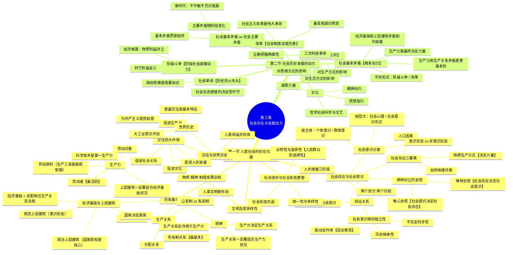

# 第三章 人类社会及其发展规律——历史唯物主义

> 以唯物史观为主线，系统梳理人类社会存在与发展的基本规律、社会历史发展的动力体系。核心线索：社会存在决定社会意识；社会基本矛盾（生产力-生产关系、经济基础-上层建筑）是推动社会发展的根本动力。

---

## 第一节 人类社会的存在与发展

### 一、社会存在与社会意识

#### （一）两种根本对立的历史观 ***

**定义**：社会存在与社会意识的关系问题是**社会历史观的基本问题**。对此问题的不同回答，形成唯物史观与唯心史观的根本分野。

**【世界观】唯心史观的缺陷**：
1. 至多考察了人的活动的**思想动机**，而没有考究思想动机背后的**物质动因和经济根源**
2. 从社会意识决定社会存在的前提出发，把社会历史看成精神发展史
3. 不懂得社会历史的**客观规律**
4. 不懂得**人民群众**在历史发展中的决定作用

**【世界观】唯物史观的基本思想**（马克思《政治经济学批判》序言）：
1. 物质生活的生产方式制约着整个社会生活、政治生活和精神生活的过程
2. **不是人们的意识决定人们的存在，而是人们的社会存在决定人们的意识**
3. 生产力发展到一定阶段便与现存生产关系发生矛盾 → 社会革命时代到来
4. 经济基础变更 → 全部上层建筑或慢或快地发生变革

**【方法论】恩格斯"墓前讲话"的经典概括**：
> 人们首先必须吃、喝、住、穿，然后才能从事政治、科学、艺术、宗教等等。直接的物质的生活资料的生产构成基础，国家设施、法的观点、艺术以至宗教观念，必须由这个基础来解释。

#### （二）社会存在 ***（三要素：自然地理、人口、物质生产方式）

**定义**：社会存在 = 社会物质生活条件，是社会生活的物质方面。

**1. 自然地理环境** *

x 定义：与人类社会所处的地理位置相联系的自然条件的总和
y 作用：人类社会生存和发展**永恒的、必要的条件**，是生活和生产的自然基础
z 关键观点：
- 自然地理环境的优劣对劳动生产率产生积极或消极影响，对发展起促进或延缓作用
- 自然地理环境的作用要受**社会发展状况**制约，特别是受物质资料生产方式的制约
- 人与自然的关系：应合理调节人与自然之间的物质变换；能动作用不能脱离自然规律轨道而盲目发挥，否则遭受大自然的报复

**【方法论】坚持人与自然和谐共生，建设生态文明。**

**2. 人口因素** *

x 定义：包含人口数量、质量、构成、分布等的综合范畴
y 作用：对社会发展起加速或延缓作用——适度人口加速发展，过密或过疏延缓发展
z 关键观点：人口因素要受社会生产状况和社会制度的制约；不能脱离社会生产而发生作用，**不能决定社会性质和社会形态的更替**

**3. 物质生产方式（决定力量）** **

x 定义：人们为获取物质生活资料而进行的生产活动的方式 = **生产力与生产关系的统一体**
y 为什么是决定力量：
- (1) 物质生产活动是人类社会**赖以存在和发展的基础**，是人类其他一切活动的首要前提
- (2) 决定社会的**结构、性质和面貌**，制约经济生活、政治生活和精神生活
- (3) 其变化发展决定整个社会历史的变化发展，决定社会形态从低级向高级的更替

**【世界观】任何一个民族，如果停止劳动，不用说一年，就是几个星期，也要灭亡。——马克思致库格曼（1868）**

#### （三）社会意识 **（分类、结构、形式）

**定义**：社会意识 = 社会存在的反映，是社会生活的精神方面。

**分类体系**：

```
社会意识
├── 按主体
│   ├── 个体意识：个体社会实践的产物
│   └── 群体意识：群体实践的产物
├── 按层次
│   ├── 社会心理（低层次）：自发、不系统、不定型 → 感性认识为主（情感、情绪、心态、习俗）
│   └── 社会意识形式（高层次）：自觉、系统化、相对稳定 → 理性认识为主
└── 按与经济基础的关系
    ├── 意识形态（观念上层建筑，具有阶级性）
    │   ├── 政治法律思想【核心地位，最直接最集中反映经济基础】
    │   ├── 道德（行为规范，依靠社会舆论+信念+习惯+传统+教育）
    │   ├── 艺术（塑造具体生动形象反映生活，审美规则）
    │   ├── 宗教（"颠倒的世界观"，自然压迫+社会压迫的产物）
    │   └── 哲学（系统化理论化的世界观，世界观和方法论的统一）
    └── 非意识形态（无阶级性）
        ├── 自然科学
        ├── 语言学
        └── 形式逻辑
```

**意识形态诸形式要点**：

x 社会心理 → 社会意识形式的基础，反过来后者对前者起指导和影响作用
y 社会意识诸形式的共性：都反映社会存在，但因反映的方面和方式不同，作用也不同
z 阶级社会中占统治地位的思想文化 = 经济上占统治地位的阶级的意识形态

**【方法论】建设具有强大凝聚力和引领力的社会主义意识形态，培育和践行社会主义核心价值观。**

#### （四）社会存在与社会意识的辩证关系 ***

**核心原理**：社会存在决定社会意识，社会意识反作用于社会存在。

**1. 社会存在决定社会意识** *

- (1) 社会存在是社会意识内容的**客观来源**，社会意识是社会物质生活过程及其条件的主观反映
- (2) 社会意识是人们进行**社会物质交往**的产物——人类最初意识是在物质生产及交往活动中产生的
- (3) 社会意识是**具体的、历史的**——随社会存在的发展而或早或迟地变化，根源深藏于经济事实中

**2. 社会意识的相对独立性（三个表现）** **

- (1) **不完全同步性和不平衡性** *：社会意识与社会存在发展不完全同步——进步的社会意识可预见未来，落后的社会意识阻碍发展；经济发展水平高的国家/地区社会意识不一定最高
- (2) **内部相互影响且有历史继承性** *：社会意识诸形式之间相互影响、相互作用；各形式均有自成系统、前后相继的历史链条
- (3) **能动的反作用（突出表现）** **：社会意识在一定条件下转化为物质力量反作用于社会存在——先进促进、落后阻碍

**【方法论】思想本身不能实现什么东西，思想要得到实现，就要有使用实践力量的人。一种社会意识发挥作用的程度、范围、时间，同它实际掌握群众的深度和广度密切联系。**

#### （五）辩证关系原理的重要意义 **——"两个划分""两个归结"

**【世界观】两个划分 + 两个归结（列宁对唯物史观方法论精髓的概括）**：

x 第一个划分：从社会生活各领域中**划分出**经济领域
y 第二个划分：从一切社会关系中**划分出**生产关系（物质的社会关系）
z 第一个归结：把一切社会关系**归结于**生产关系
z 第二个归结：把生产关系**归结于**生产力的高度

→ 从而将社会形态的发展看作"自然历史过程"，科学揭示人类社会发展的规律。

**【方法论】社会存在和社会意识辩证关系原理的指导意义**：
- 我国社会改革和发展的顶层设计，必须从我国现实的社会存在出发 = 从基本国情和发展要求出发
- 发挥社会意识的能动作用，发扬历史主动精神，科学分析和把握历史大势

---

### 二、社会基本矛盾及其运动规律 **

**核心定位**：生产力与生产关系、经济基础与上层建筑的矛盾 = **人类社会基本矛盾**；两对矛盾运动的规律 = **人类社会发展的基本规律**。

#### （一）生产力与生产关系的矛盾运动及其规律 ***

**1. 生产力及其三要素** ***

**定义**：生产力 = 人类在生产实践中形成的**改造和影响自然**以使其适合社会需要的**物质力量**。具有客观现实性和社会历史性。

**三要素**：

| 要素 | 内涵 | 地位 |
|:-----|:-----|:-----|
| **劳动资料（劳动手段）** | 劳动过程中运用的物质资料或物质条件 | **生产工具最重要**——"各种经济时代的区别，不在于生产什么，而在于怎样生产，用什么劳动资料生产"（区分经济时代的客观依据） |
| **劳动对象** | 引入生产过程的一切自然物质和深度加工对象 | 现实生产的必要前提，影响劳动产品质量和数量 |
| **劳动者** | 有生产经验、技能和知识，运用劳动资料作用于劳动对象的人 | **最活跃的因素**——包括体力和脑力劳动者；现代生产中以脑力劳动者质量数量为决定因素 |

**科学技术是第一生产力** **：
- 科学技术能渗透生产力各要素（劳动资料 → 变革、劳动对象 → 扩大、劳动者素质 → 提高）
- 应用于生产组织管理 → 提高管理效率
- 为劳动者所掌握 → 提高劳动生产率
- 在当代，科技日益成为生产发展的**决定性因素**，是先进生产力的集中体现和主要标志

**2. 生产关系及其三方面** ***

**定义**：生产关系 = 人们在物质生产过程中形成的**不以人的意志为转移的经济关系**。

x 三方面：生产资料所有制关系（**最基本、起决定作用**）→ 生产中人与人的关系 → 产品分配关系

y 两种基本类型：

| 类型 | 特征 |
|:-----|:-----|
| 公有制为基础的生产关系 | 生产资料共同占有，平等地位，无剥削 |
| 私有制为基础的生产关系 | 生产资料归少数剥削者占有，存在剥削 |

z 重要提醒：生产关系不是"物"，但总是同物结合并作为物出现——分析时必须透过"物"看到"物"后面的人与人的关系。

**3. 生产力与生产关系的辩证关系** ***

- (1) **生产力决定生产关系**：生产力状况决定生产关系性质 → "手推磨产生的是封建主的社会，蒸汽磨产生的是工业资本家的社会"；生产力发展决定生产关系的变革
- (2) **生产关系反作用于生产力**：适合时 → 推动作用；不适合时 → 阻碍作用（包括落后和"拔高"两种情况）
- (3) **矛盾运动的规律：生产关系一定要适合生产力状况的规律** **：生产关系总是从基本适合 → 基本不适合 → 新的基础上的基本适合；循环往复，推动社会生产发展，进而推动整个社会走向高级阶段

**【方法论】意义**：
- 第一次确立了生产力发展是"社会进步的最高标准"（列宁）
- 是马克思主义政党制定路线、方针和政策的重要依据
- 社会主义的根本任务是解放和发展社会生产力

#### （二）经济基础与上层建筑的矛盾运动及其规律 ***

**1. 经济基础与上层建筑的内涵** **

x 经济基础 = 由社会一定发展阶段的生产力所决定的**占支配地位的生产关系总和**（注意：不是一切生产关系之和）
y 上层建筑 = 经济基础之上的意识形态 + 相应制度、组织和设施

```
上层建筑
├── 观念上层建筑（意识形态）
│   ├── 政治法律思想
│   ├── 道德
│   ├── 艺术
│   ├── 宗教
│   └── 哲学
└── 政治上层建筑（核心：国家政权）
    ├── 政治法律制度（国家政治制度、立法司法制度、行政制度）
    └── 政治组织与设施（国家政权机构、政党、军队、警察、法庭、监狱等）
```

z 观念上层建筑与政治上层建筑的关系：政治上层建筑在一定意识形态指导下建立（统治阶级意志的体现）；政治上层建筑一旦形成，就成为一种现实力量影响并制约人们的思想理论观点。

**2. 国家：国体与政体** *

x **国家的实质**：阶级矛盾不可调和的产物 → "一种表面上凌驾于社会之上的力量" → 一个阶级统治另一个阶级的**工具** → 强制性暴力机关
y **国家的双重职能**：政治统治 + 社会管理；政治统治以执行社会职能为基础
z **国体与政体**：
- 国体 = 社会各阶级在国家中的地位（谁是统治阶级）——**国体决定政体**
- 政体 = 统治阶级实现统治的具体组织形式（政权构成形式）——**政体反作用于国体**

**【世界观】社会主义民主的本质和核心是人民当家作主，是其他任何国家形态的民主都不能比拟的最广泛的民主。**

**3. 经济基础与上层建筑的辩证关系** ***

- (1) **经济基础决定上层建筑**：经济基础的性质决定上层建筑的性质，经济基础的变更决定上层建筑的变革方向
- (2) **上层建筑反作用于经济基础**：为自己的经济基础的形成和巩固服务——当为适合生产力要求的经济基础服务 → 进步力量；当为落后经济基础服务 → 消极力量
- (3) **矛盾运动**：同一性质内部有不完善部分的矛盾；不同性质之间有新旧上层建筑、新旧经济基础之间的矛盾；上升阶段 → 适应，没落阶段 → 对抗性、全局性矛盾
- (4) **上层建筑一定要适合经济基础状况的规律**：经济基础状况决定上层建筑发展方向和调整/变革；上层建筑的反作用必须服从于经济基础的性质和要求

**【方法论】积极稳妥推进上层建筑领域改革，实现好、维护好、发展好最广大人民的根本利益。**

---

### 三、人类普遍交往与世界历史的形成发展 *

#### （一）交往及其作用 *

**定义**：交往 = 在一定历史条件下的现实的个人、群体、阶级、民族、国家之间在**物质和精神上**相互往来、相互作用、彼此联系的活动。

x 分类：**物质交往**（基础+根源）+ **精神交往**（产物，渗透于物质交往中）
y 交往水平与生产力水平正相关：孤立封闭 ↔ 落后生产力；交流交往开放 ↔ 先进生产力
z **四大作用**：

- (1) 促进**生产力**的发展——生产经验的传播与积累、科技成果的保存依赖交往扩展
- (2) 促进**社会关系**的进步——交往活动是各种社会关系形成和发展的重要动力
- (3) 促进**文化**的发展与传播——特别是学术文化交往是知识创新创造的重要动力
- (4) 促进**人的全面**发展——"一个人的发展取决于和他直接或间接进行交往的其他一切人的发展"

#### （二）世界历史的形成和发展 *

**定义**：世界历史 = 各民族、国家通过**普遍交往**，打破孤立隔绝状态，进入相互依存、相互联系的世界整体化的历史。

x 形成动力：资本主义生产方式的发展和交往的普遍化 → 大工业 "首次开创了世界历史"
y 基本特征：**普遍交往**——所有国家都进入世界市场，"一切国家的生产和消费都成为世界性的了"
z 历史走向：世界历史的深化 → 共产主义实现的前提（"以生产力的普遍发展和与此相联系的世界交往为前提"）

**【方法论】人类命运共同体**：站在世界历史的高度审视当今世界发展趋势和面临的重大问题；万物并育而不相害，道并行而不相悖；弘扬和平、发展、公平、正义、民主、自由的全人类共同价值。

---

### 四、社会进步与社会形态更替 *

#### （一）社会进步与人的发展 *

**社会进步的两大表现**：社会形态从低级到高级的发展 + 同一社会形态内部的改革进步

**人的发展三阶段**：人的依赖关系占统治地位→以物的依赖关系为基础的人的独立性→自由个性（共产主义社会）

#### （二）社会形态的内涵 *

**定义**：社会形态 = 同生产力发展一定阶段相适应的**经济基础与上层建筑的统一体**，包括经济形态、政治形态和意识形态。

#### （三）社会形态更替的统一性与多样性 *

x **统一性**：五种社会形态依次更替（原始社会 → 奴隶社会 → 封建社会 → 资本主义社会 → 共产主义社会/社会主义是其第一阶段）= 一般规律
y **多样性**：不同国家/民族的跨越式发展、非典型社会形态、停滞或快速跃进等

**【世界观】世界历史发展的一般规律丝毫不排斥个别发展阶段在发展的形式或顺序上表现出特殊性，反而是以此为前提。——列宁**

#### （四）社会形态更替中的必然性与选择性 *

**定义**：必然性 = 社会形态更替的基本趋势确定不移，根源于社会基本矛盾运动（最终由生产力发展决定）；选择性 = 人们在客观规律基础上对历史路径的能动选择。

x **选择性的第一层次**：社会发展的必然性造成基本趋势，为历史选择提供基础、范围和可能性空间
y **选择性的第二层次**：社会形态更替是主观能动性与客观规律性统一的过程——要受目的驱使，又必须遵循客观规律
z **选择性的第三层次**：历史选择性归根结底是**人民群众的选择性**——取决于人民群众的根本利益、意愿及对规律的把握

**【世界观】中国特色社会主义道路是中国社会历史发展的必然，也是中国人民的自觉选择。**

---

### 五、文明及其多样性 *

#### （一）文明及其演进 *

**定义**：文明 = 人类创造的所有**物质成果、精神成果和制度成果的总和**，是标志社会进步程度的范畴；"文明是实践的事情，是社会的素质"（马克思）。

x 文明演进：社会形态的更替也是文明形态的更替；超越资本主义的新文明——社会主义文明（共产主义文明的初级阶段）
y 中国特色社会主义创造了**人类文明新形态** = 物质文明、政治文明、精神文明、社会文明、生态文明协调发展

#### （二）文明的多样性 *

x "人类文明多样性是世界的基本特征，也是人类进步的源泉"
y 文明交流互鉴：以文明交流超越文明隔阂、文明互鉴超越文明冲突、文明共存超越文明优越

---

## 第二节 社会历史发展的动力

### 一、社会基本矛盾在历史发展中的作用 ***

#### （一）社会基本矛盾是历史发展的根本动力 ***

**定义**：社会基本矛盾 = 贯穿社会发展过程始终，规定社会发展过程的基本性质和基本趋势，对社会历史发展起**根本推动作用**的矛盾——**生产力与生产关系、经济基础与上层建筑的矛盾**。

**社会基本矛盾的作用机制**：

- (1) **生产力是最终决定力量** **：生产力是社会存在和发展的物质基础，是社会进步的根本内容和衡量社会进步的根本尺度；生产力决定生产关系性质，进而决定其他社会关系的基本面貌
- (2) **生产力和生产关系的矛盾是更基本的矛盾**，决定经济基础与上层建筑矛盾的产生产发展和解决——"一切历史冲突都根源于生产力和交往形式之间的矛盾"
- (3) **经济基础与上层建筑的矛盾影响并制约**前一对矛盾的解决——生产关系变化受制于上层建筑的变化或变革
- (4) **不同表现形式与解决方式**：阶级社会中 → 通过阶级矛盾和阶级斗争表现；同一社会形态中 → 通过改革解决

**【方法论】社会基本矛盾分析方法**：把生产力和生产关系的矛盾运动同经济基础和上层建筑的矛盾运动结合起来观察，作为一个整体来把握整个社会的基本面貌和发展方向。

#### （二）社会基本矛盾与社会主要矛盾的区别和联系 **

| 比较维度 | 社会基本矛盾 | 社会主要矛盾 |
|:---------|:------------|:------------|
| 延续性 | 贯穿人类社会**始终** | 随历史阶段变化而变化 |
| 层次 | 深层根源 | 社会基本矛盾的**具体体现** |
| 地位 | 规定和制约主要矛盾 | 处于支配地位，起主导作用 |
| 关联 | 是其他一切社会矛盾的根源 | 规定或影响非主要矛盾 |

**我国社会主要矛盾的转化** **：
- 原来：人民日益增长的物质文化需要同落后的社会生产之间的矛盾
- 现在：**人民日益增长的美好生活需要和不平衡不充分的发展之间的矛盾**

**【方法论】紧紧扭住社会主要矛盾不放，这是正确理解和把握新时代的"钥匙"，是解决其他矛盾的"牛鼻子"。**

---

### 二、阶级斗争、社会革命在社会发展中的作用 ***

#### （一）阶级与阶级斗争 ***

**列宁的阶级定义**：
> 所谓阶级，就是这样一些大的集团，这些集团在历史上一定社会生产体系中所处的地位不同，同生产资料的关系不同，在社会劳动组织中所起的作用不同，因而领得自己支配的那份社会财富的方式和多寡也不同。由于它们在一定社会经济结构中所处的地位不同，其中一个集团能够占有另一个集团的劳动。

x 阶级是一个**经济范畴**，也是一个**历史范畴**——产生、存在和发展同经济发展过程联系在一起
y 阶级斗争 = 阶级利益根本冲突的对抗阶级之间的对立和斗争；根源在于物质利益的根本对立
z 阶级斗争的历史作用：
- (1) 社会形态更替中 → 推动新旧社会制度更替的**直接动力**
- (2) 同一社会形态量变中 → 打击剥削阶级统治，迫使改良，推动社会进步

**【方法论】马克思主义的阶级分析方法**——全面、动态地分析阶级状况、经济地位、政治立场和意识形态，是认识阶级社会本质和规律的"指导性线索"。在社会主义初级阶段，既要防止阶级斗争扩大化，也要防止阶级斗争熄灭论。

#### （二）社会革命——"革命是历史的火车头" ***

**定义**：社会革命 = 革命阶级推翻反动阶级的统治，用新社会制度代替旧社会制度；国家政权从反动阶级手里转移到革命阶级手里是**首要的基本标志**。

x 根源：社会基本矛盾的尖锐化（客观条件：经济+政治；主观条件：革命阶级的觉悟程度+组织程度+群众发动程度）
y 作用：
- "革命是历史的火车头"（马克思）——实现社会形态更替的**决定性环节**
- "社会进步和政治进步的强大推动力"（马克思）
- "人民群众在任何时候都不能像在革命时期这样以新社会制度的积极创造者的身份出现"（列宁）
z 与改良的关系：马克思主义不拒绝改良，但反对**改良主义**（用改良代替社会革命，不触及深层矛盾）

#### （三）改革在社会发展中的作用 *

**定义**：改革 = 一定社会对生产关系和上层建筑进行的深刻改变和革新，是社会制度的**自我调整和完善**，是同一种社会形态发展过程中的量变和部分质变。

x 改革与革命的区别：
- 革命 → 解决现存社会基本制度问题，推翻旧制度建立新制度（根本质变）
- 改革 → 解决现存社会体制问题，在不改变基本制度前提下变革生产关系和上层建筑的某些方面和环节（量变+部分质变）

**【世界观】中国的社会主义改革**：性质上是社会主义制度的自我完善和发展；从广泛性和深刻性而言是"一场伟大的革命"；是社会主义社会发展的强大动力。

---

### 三、科学技术在社会发展中的作用 **

**定义**：科学 = 对自然、社会和人类思维的正确认识，反映客观事实和规律的知识体系及其活动。技术 = 人类改造自然、进行生产的方法与手段。科学和技术是辩证统一的整体，日趋一体化。

#### （一）科技革命是推动经济和社会发展的强大杠杆 **

**三次科技革命概览**：

| 时期 | 标志 | 影响 |
|:-----|:-----|:-----|
| 18世纪70年代 | 蒸汽机发明 | 第一次产业革命，资本主义机器大工业 |
| 19世纪末20世纪初 | 电力广泛运用 | 生产力又一次迅猛发展 |
| 20世纪中期以后 | 原子能、电子计算机、空间技术、信息技术等 | 互联网、智能化、数字化时代 |

**(1) 对生产方式的深刻影响** **

x 改变社会生产力的构成要素——脑体劳动比例改变，劳动力结构向智能化趋势发展
y 改变劳动形式——智能机器替代部分脑力劳动，从机械自动化走向智能自动化
z 改变社会经济结构——产业结构变革（第三产业比重增大）、就业结构变化（科技和管理人员比例增长）、推动生产关系变革

**(2) 对生活方式的深刻影响** *

x 信息时代要求不断更新知识，学习成为生活中重要内容
y 现代信息技术为处理、存储和传递信息提供手段，便利学习工作
z 劳动生产率提高 → 闲暇时间增多 → 为人的自由全面发展创造条件

**(3) 对思维方式的深刻影响** *

x 新科学理论和技术手段通过影响**思维主体、思维客体和思维工具**引起思维方式变革

**【方法论】科技创新是撬动地球的杠杆——中国要强盛、要复兴，一定要大力发展科学技术，建成世界科技强国。**

#### （二）正确把握科学技术社会作用的两面性 *

**积极作用**：改造自然能力增强，创造更多物质财富，推动社会发展

**消极后果**：
x 对自然规律认识不足或缺乏控制手段 → 环境破坏、生态失衡、生命伦理问题（基因工程、克隆技术等）、互联网信息安全与隐私问题
y 与一定社会制度有关 → 在资本主义条件下，科学技术"表现为异己的、敌对的和统治的权力"；霸权主义国家凭借科技优势进行不公平贸易甚至侵略

**【方法论】要有合理的社会制度保障科技的正确运用，始终坚持使科技为人类社会健康发展服务，让科技为人类造福。**

---

### 四、文化在社会发展中的作用 *

**定义**：狭义文化 = 人类的精神生产活动及其结果，与**经济、政治**相对应的观念形态的文化，是对社会经济、政治的反映。文化是一个国家、一个民族的灵魂。

**文化的四大作用**：

- (1) **思想指引** *：先进文化为社会发展和变革指明方向；中国特色社会主义文化是中国人民胜利前行的强大精神力量和可靠思想指引
- (2) **精神动力** *：没有先进文化的积极引领和智力支持，没有人民精神世界的极大丰富，一个国家、一个民族不可能屹立于世界民族之林
- (3) **凝聚力量** *：核心价值观规范社会道德、凝聚社会共识、增进价值认同；"中华文化使中华民族保持了坚定的民族自信和强大的修复能力"
- (4) **哲学社会科学与文艺** *：哲学社会科学反映民族的思维能力、精神品格和文明素质；文艺以美育人、以美化人

**【世界观】文化兴则国家兴，文化强则民族强。**

---

## 思维导图


