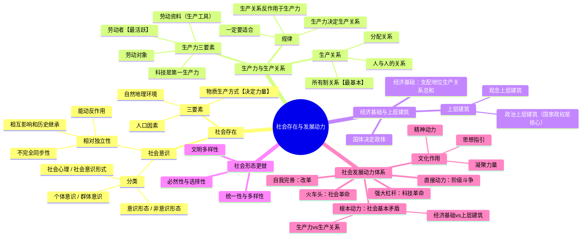

# 第三章 社会存在与社会发展动力

> 笔记以 Q&A 形式覆盖"人类社会的存在与发展"与"社会历史发展的动力"两节核心知识点。

---

## 一、人类社会的存在与发展

### ❓ 1. 两种对立的历史观是什么？

✅ **唯物史观**与**唯心史观**的根本对立在于：社会存在与社会意识何者为第一性。

- **唯心史观**：认为社会意识决定社会存在，夸大精神、意志、观念在历史中的作用。
- **唯物史观**：认为社会存在决定社会意识，物质资料的生产方式是社会发展的决定力量。

唯物史观的创立是哲学史上最伟大的变革之一，"两个划分""两个归结"是理解这一变革的关键线索。

---

### ❓ 2. 社会存在包括哪三个要素？哪一个是决定力量？

✅ 社会存在三要素：

| 要素 | 地位 |
|------|------|
| **自然地理环境** | 人类社会生存和发展的永恒的、必要的条件 |
| **人口因素** | 社会主体条件，影响社会发展速度 |
| **物质生产方式** | **决定力量**——决定社会的结构、性质和面貌 |

物质生产方式是生产力和生产关系的统一体，它从根本上决定了社会制度的性质和更替。

---

### ❓ 3. 社会意识有哪些分类？意识形态与非意识形态如何区分？

✅ 社会意识分类体系：

```
社会意识
├── 按主体      个体意识 / 群体意识
├── 按层次      社会心理（自发、表层）/ 社会意识形式（自觉、系统化）
└── 按与经济基础的关系
    ├── 意识形态（上层建筑，反映特定经济基础）
    │   ├── 政治法律思想（核心）
    │   ├── 道德
    │   ├── 艺术
    │   ├── 宗教
    │   └── 哲学
    └── 非意识形态（无阶级性）
        ├── 自然科学
        ├── 语言学
        └── 逻辑学
```

- **意识形态**：属于观念上层建筑，反映并维护特定经济基础，具有阶级性。
- **非意识形态**：不反映特定阶级利益，不具有阶级性。

---

### ❓ 4. 社会存在与社会意识的辩证关系是什么？

✅ **社会存在决定社会意识**：社会存在是社会意识内容的客观来源，社会存在的发展变化决定社会意识的发展变化。

✅ **社会意识具有相对独立性**（三大表现）：

1. **不完全同步性**：社会意识与社会存在的发展并非总是同步——可能超前（先进思想）或滞后（落后的社会心理与观念）。
2. **内部相互影响和历史继承性**：各种社会意识形式之间相互制约、相互影响；每一种社会意识形式都有自身的历史继承关系。
3. **能动反作用**：社会意识对社会存在具有能动的反作用——先进的社会意识促进社会发展，落后的社会意识阻碍社会发展。这是社会意识相对独立性**最突出**的表现。

---

### ❓ 5. 什么是"两个划分"和"两个归结"？

✅ 这是列宁对唯物史观方法论精髓的经典概括：

- **"两个划分"**：
  - 从社会生活的各种领域中**划分出**经济领域
  - 从一切社会关系中**划分出**生产关系（物质的社会关系）

- **"两个归结"**：
  - 把一切社会关系**归结于**生产关系
  - 把生产关系**归结于**生产力的高度

这一方法论将复杂的社会现象还原为物质根源，使对社会历史的认识成为科学。

---

### ❓ 6. 生产力包含哪三个要素？谁是第一生产力？

✅ **生产力三要素**：

| 要素 | 内涵与意义 |
|------|-----------|
| **劳动资料**（劳动手段） | 其中**生产工具**是区分经济时代的客观依据——"手推磨产生的是封建主的社会，蒸汽磨产生的是工业资本家的社会" |
| **劳动对象** | 一切被加工的自然物和原材料 |
| **劳动者**（人） | **最活跃、最革命的因素**；生产力中最能动的要素 |

✅ **科学技术是第一生产力**：科技渗透到生产力各要素之中，引发生产力质的飞跃，在现代社会中居于首要驱动地位。

---

### ❓ 7. 生产关系的构成与基本类型是什么？

✅ **生产关系三方面构成**：

1. **生产资料所有制关系**——**最基本、起决定作用**（决定其他两个方面）
2. 生产中人与人的关系
3. 产品分配关系

✅ **两种基本类型**：

| 类型 | 特征 |
|------|------|
| 公有制为基础 | 生产资料归劳动者共同所有，成员间平等互助 |
| 私有制为基础 | 生产资料归少数人占有，存在剥削关系 |

---

### ❓ 8. 生产力与生产关系的辩证关系及规律是什么？

✅ **生产力决定生产关系**：
- 生产力的性质和水平决定生产关系的性质和形式
- 生产力的发展决定生产关系的变革

✅ **生产关系反作用于生产力**：
- 适合时：推动生产力发展
- 不适合时：阻碍甚至破坏生产力发展

✅ **生产关系一定要适合生产力状况的规律**：
这是人类社会发展的**最基本规律**，贯穿于一切社会形态。无论生产关系落后还是"超越"生产力，都会阻碍生产力发展——必须与之相适应。

---

### ❓ 9. 什么是经济基础与上层建筑？国家政权在上层建筑中处于什么地位？

✅ **经济基础**：由社会一定发展阶段的生产力所决定的**占支配地位的生产关系总和**。注意：不是一切生产关系的总和，而是占支配地位的生产关系的总和。

✅ **上层建筑**：
- **观念上层建筑**（思想上层建筑/意识形态）：政治法律思想、道德、艺术、宗教、哲学等
- **政治上层建筑**：国家政权、政治法律制度、军队、警察、法庭、监狱等

✅ **国家政权是上层建筑的 核心**：政治上层建筑以国家政权为核心，整个上层建筑体系中，国家政权居于主导地位。

---

### ❓ 10. 国体与政体的关系是什么？

✅ **国体**即国家的阶级性质——社会各阶级在国家中的地位（谁是统治阶级、谁是被统治阶级）。

✅ **政体**即政权的组织形式——统治阶级采取何种形式组织自己的政权。

✅ **关系**：**国体决定政体，政体反作用于国体**。同一国体可以采取不同政体（如资产阶级国家有君主立宪制与民主共和制），好的政体形式可以更好地实现统治阶级的利益。

---

### ❓ 11. 交往的四大作用与世界历史的形成特征是什么？

✅ **交往的四大作用**：

1. 促进**生产力**的发展与传播
2. 推动**生产关系**的变革
3. 促进**文化**的交流与发展
4. 促进**人自身**的发展

✅ **世界历史的形成**：
- 随着生产力的发展和交往的扩大，历史从民族历史向**世界历史**转变
- **普遍交往**是世界历史的基本特征
- 世界历史不是各民族历史的简单相加，而是各民族在普遍交往中相互作用、相互影响形成的有机整体

---

### ❓ 12. 社会形态更替有哪些辩证特征？

✅ **统一性与多样性**：
- **统一性**：社会形态由低级向高级发展的总趋势是一致的（原始社会→奴隶社会→封建社会→资本主义社会→社会主义/共产主义社会）
- **多样性**：不同民族、国家的具体发展道路各有特色，可能出现跨越式发展

✅ **必然性与选择性**：
- **必然性**：社会形态更替有其客观规律，不以人的意志为转移
- **选择性**：人在历史规律面前具有主体能动性，可以在多种可能性中进行选择

---

### ❓ 13. 怎样理解文明及其多样性？

✅ **文明**：人类在社会实践中创造的一切积极成果的总和，是社会进步和开化状态的标志。

✅ **文明多样性**是人类社会的基本特征：
- 不同民族、不同地域创造和发展了各具特色的文明形态
- 文明因交流而多彩，因互鉴而丰富
- 尊重文明多样性，推动不同文明交流互鉴

---

## 二、社会历史发展的动力

### ❓ 14. 什么是社会基本矛盾？为什么说它是社会发展的根本动力？

✅ **社会基本矛盾**即贯穿人类社会始终、规定社会基本性质和结构的两对矛盾：

1. **生产力与生产关系的矛盾**
2. **经济基础与上层建筑的矛盾**

✅ 这两对矛盾之所以是**根本动力**，是因为：
- 它们贯穿于人类社会发展的**全过程**
- 规定了社会的**基本结构**和**性质**
- 推动社会形态从低级向高级更替
- 一切社会变革的根源都可以从社会基本矛盾中找到

其中，生产力和生产关系的矛盾是**更为根本**的矛盾，经济基础和上层建筑的矛盾受前者制约。

---

### ❓ 15. 社会基本矛盾与社会主要矛盾的关系是什么？

✅ **联系**：
- 社会基本矛盾是社会主要矛盾的**深层根源**
- 社会主要矛盾是社会基本矛盾在特定历史阶段的**集中体现**

✅ **区别**：
- 社会基本矛盾贯穿人类社会的**始终**（永恒存在）
- 社会主要矛盾随历史阶段变化而**变化**（如近代中国：帝国主义与中华民族的矛盾、封建主义与人民大众的矛盾；新时代中国：人民日益增长的美好生活需要与不平衡不充分的发展之间的矛盾）

---

### ❓ 16. 列宁怎样定义阶级？为什么说阶级斗争是阶级社会发展的直接动力？

✅ **列宁的阶级定义**：
> 所谓阶级，就是这样一些大的集团，这些集团在历史上一定社会生产体系中所处的地位不同、对生产资料的关系（这种关系大部分是在法律上明文规定了的）不同、在社会劳动组织中所起的作用不同、因而领得自己所支配的那份社会财富的方式和多寡也不同。其中一个集团能够占有另一个集团的劳动。

✅ **阶级斗争是直接动力**：
- 在阶级社会中，社会基本矛盾必然表现为**阶级矛盾和阶级斗争**
- 它是推动阶级社会形态更替的**直接动力**（不是唯一动力，也不是根本动力——根本动力是社会基本矛盾）
- 阶级斗争贯穿于阶级社会的全部历史

---

### ❓ 17. 怎样理解社会革命？为什么说"革命是历史的火车头"？

✅ **社会革命**：革命阶级推翻反动阶级的统治，用先进的社会制度代替腐朽的社会制度。

✅ "革命是历史的火车头"（马克思语）的含义：
- 革命是社会形态更替的**决定性环节**
- 革命能极大地**解放生产力**
- 革命能激发人民群众的历史主动性和创造精神
- 革命解决的是社会基本矛盾不可调和的对抗

---

### ❓ 18. 改革与社会革命有何区别？社会主义改革有什么特点？

✅ **改革与社会革命的区别**：

| 比较维度 | 社会革命 | 改革 |
|----------|---------|------|
| 性质 | 根本质变——推翻旧制度 | 量变或部分质变——在现存制度内调整 |
| 主体 | 革命阶级推翻反动阶级 | 统治阶级自上而下的自我完善 |
| 方式 | 暴力或非暴力的政权更替 | 在现存政权框架内有序推进 |
| 目标 | 建立全新的社会制度 | 完善和发展现存社会制度 |

✅ **社会主义改革**：
- 是社会主义制度的**自我完善和发展**
- 不是否定社会主义基本制度，而是革除其具体体制中的弊端
- 是社会主义社会发展的**直接动力**
- 改革开放是决定当代中国命运的关键一招

---

### ❓ 19. 科技革命对社会发展产生哪些深刻影响？

✅ **对生产方式的深刻影响**：
- 改变生产力的要素和结构，极大提高劳动生产率
- 推动产业结构变革和升级
- 改变生产中人与人的关系

✅ **对生活方式的深刻影响**：
- 改变人们的生活方式和生活习惯
- 改善人们的物质生活条件
- 扩展人们的交往方式和范围

✅ **对思维方式的深刻影响**：
- 更新人们的思维观念
- 拓展人们的认识领域
- 推动科学精神和理性思维的普及

---

### ❓ 20. 文化在社会发展中发挥哪些重要作用？

✅ **文化的四大作用**：

1. **思想指引**：文化为社会发展和人类进步提供思想引领和方向
2. **精神动力**：文化为社会发展提供精神支撑和激励力量
3. **凝聚力量**：文化凝聚民族精神、增强社会认同感和向心力
4. **智力支持**：文化的繁荣为社会全面发展提供智力支持（通过教育、科学等）

---

## 思维导图


