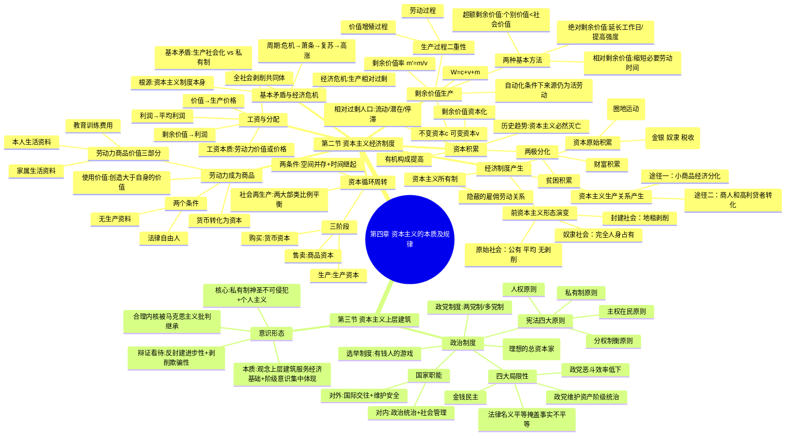

# 第四章 资本主义的本质及规律

## 第二节 资本主义经济制度

### 一、资本主义经济制度的产生

#### （一）前资本主义社会形态的演进和更替 ***【世界观】

社会形态演进的根本动力是**生产力与生产关系的矛盾运动**。人类社会依次经历：

| 社会形态 | 生产力特征 | 生产关系核心 | 剥削形式 |
|:---------|:-----------|:-------------|:---------|
| **原始社会** | 石器→金属工具，生产力极低 | 生产资料公有，集体劳动，平均分配 | 无阶级、无剥削 |
| **奴隶社会** * | 金属工具普及，协作劳动 | 奴隶主占有生产资料和奴隶人身 | 完全人身占有 |
| **封建社会** * | 自然经济，技术停滞 | 封建主占有土地，不完全占有农民 | 地租（劳役/实物/货币） |

- 奴隶社会第一次出现**城乡分离**和**脑力劳动与体力劳动分离**，促进了文化繁荣。
- 封建社会末期，生产力发展 + 商品经济发展 → 封建生产关系成为障碍 → 农村自然经济和城市行会组织瓦解 → 资本主义生产关系萌芽。

---

#### （二）资本主义生产关系的产生 ***【世界观】

> "资本主义社会的经济结构是从封建社会的经济结构中产生的。后者的解体使前者的要素得到解放。" ——马克思

资本主义萌芽于 **14 世纪末—15 世纪初**地中海沿岸城市。产生的**两个途径**：

| 途径 | 过程 | 结果 |
|:-----|:-----|:-----|
| **小商品经济分化** ** | 小生产者竞争 → 两极分化：条件好的扩大规模、雇佣工人 → 成为工业资本家；多数破产 → 沦为雇佣工人 | 行会师徒关系 → 雇佣关系 |
| **商人和高利贷者转化** ** | 商人成为包买商，控制购销渠道和原料 → 小生产者沦为债务人 → 无力还债交出作坊 | 商人/高利贷者 → 工业资本家 |

---

#### （三）资本的原始积累 ***【世界观】

> "资本来到世间，从头到脚，每个毛孔都滴着血和肮脏的东西。" ——马克思

**定义**：以**暴力手段**使生产者与生产资料相分离、资本迅速集中于少数人手中的历史过程。时期：15 世纪末—19 世纪初。

**两个主要途径**：

| 途径 | 典型方式 | 后果 |
|:-----|:---------|:-----|
| **剥夺农民土地** **（基础） | 英国圈地运动：羊毛需求上涨 → 圈占农民土地改作牧场 → 农民变成流浪者 → 被迫出卖劳动力。还包括掠夺教会地产、盗窃公有地等 | 奠定资本主义土地私有制基础 |
| **殖民掠夺** ** | 武力征服殖民地、屠杀居民、抢劫金银（中南美洲 250 万公斤黄金 + 1 亿公斤白银）、贩卖黑人（非洲丧失人口超 1 亿）、国债/税收/保护关税制度 | 加速货币资本积累，缩短封建→资本主义历史进程 |

**核心结论**：资产阶级的发家史就是一部罪恶的掠夺史。

---

#### （四）资本主义所有制的确立 **【世界观】

三种剥削制度中劳动者与生产资料的结合方式对比：

| 制度 | 结合方式 | 剥削特点 |
|:-----|:---------|:---------|
| 奴隶制 | 奴隶主完全占有奴隶人身 | 完全占有 |
| 封建制 | 农民对封建主的人身依附 | 人身依附 |
| **资本主义制** | 劳动者人身自由，但无生产资料 → 出卖劳动力 | **隐蔽的雇佣劳动关系** |

资本主义所有制下：资本家拥有生产资料所有权 + 对雇佣劳动者的支配权 → 无偿占有剩余价值。剥削带有**隐蔽性**——形式上"自由""平等"，实质上剥削与被剥削。

---

### 二、劳动力成为商品与货币转化为资本 ***

#### （一）劳动力成为商品的两个基本条件 **【世界观】

1. 劳动者是**法律上的自由人**，能把自己的劳动力当作商品来支配。
2. 劳动者**没有任何生产资料**，没有生活资料来源，只能靠出卖劳动力为生。

> 这两个条件是在封建社会后期的**资本原始积累**过程中逐渐形成的。劳动力成为商品 → 标志着简单商品生产发展到资本主义商品生产的新阶段。

> "罗马的奴隶是由锁链，雇佣工人则由看不见的线系在自己的所有者手里。" ——马克思

---

#### （二）劳动力商品的特点与货币转化为资本 ***【世界观】

**资本总公式的矛盾**：

- 简单商品流通：W—G—W（目的是获得使用价值）
- 资本总公式：G—W—G'（目的是价值增殖，G' = G + ΔG）
- 矛盾：等价交换原则下，流通中如何产生新价值？关键在**劳动力成为商品**。

**劳动力商品的价值**（三部分）：

1. 维持劳动者**本人**生存所必需的生活资料价值
2. 维持劳动者**家属**生存所必需的生活资料价值
3. 劳动者**接受教育和训练**所支出的费用

> 劳动力价值包含**历史和道德的因素**，最低界限 = 生活上不可缺少的生活资料价值。

**劳动力商品的使用价值**（最核心特点）：

| 特点 | 内容 |
|:-----|:-----|
| **价值源泉** *** | 在消费（即劳动）过程中能创造新价值 |
| **增殖性** *** | 创造的新价值 **大于** 劳动力本身的价值 |
| **关键意义** | 货币购买到劳动力 → 消费它 → 得到增殖的价值（剩余价值 m）→ 货币转化为**资本** |

**资本的定义**：资本是**能够带来剩余价值的价值**。但资本不是物，而是**一定的、社会的、属于一定历史社会形态的生产关系**。

---

### 三、生产剩余价值是资本主义生产方式的绝对规律 ***

> "生产剩余价值或赚钱，是这个生产方式的绝对规律。" ——马克思

#### （一）剩余价值的生产过程和资本的不同部分 ***

**资本主义生产过程的二重性**：

| 方面 | 内容 | 地位 |
|:-----|:-----|:-----|
| **劳动过程** | 生产物质资料：劳动者的劳动 + 劳动对象 + 劳动资料 → 使用价值 | 载体 |
| **价值增殖过程** | 超过劳动力价值补偿点而延长了的价值形成过程 → 剩余价值 | **主要方面** |

资本主义劳动过程两个特点：① 工人在资本家监督下劳动；② 劳动产品全部归资本家所有。

**必要劳动与剩余劳动**：
- 必要劳动 → 再生产劳动力价值
- 剩余劳动 → 为资本家无偿生产剩余价值

**剩余价值定义** ***：雇佣工人所创造并被资本家无偿占有的**超过劳动力价值**的那部分价值，是雇佣工人剩余劳动的凝结。

---

**不变资本与可变资本** ***：

| 类别 | 形态 | 特点 | 符号 |
|:-----|:-----|:-----|:----|
| **不变资本** | 生产资料（机器、厂房、原料） | 只转移原有价值，**不增殖** | **c** |
| **可变资本** | 购买劳动力的资本 | 由工人劳动再生产，且**创造剩余价值** | **v** |

**商品价值构成公式** ***：**W = c + v + m**

**重大意义**：
- 揭示剩余价值的**唯一源泉**：雇佣劳动者的剩余劳动（可变资本雇佣的劳动者创造），而非全部资本
- 为衡量剥削程度提供科学依据

---

**剩余价值率** ***：

| 公式 | 含义 |
|:-----|:-----|
| **m' = m / v** | 剩余价值 / 可变资本（物化劳动形式） |
| **m' = 剩余劳动 / 必要劳动 = 剩余劳动时间 / 必要劳动时间** | 活劳动形式 |

剩余价值率精确反映**资本家对工人的剥削程度**。

---

#### （二）剩余价值生产的两种基本方法 ***

| 方法 | 定义 | 实现手段 | 时期 |
|:-----|:-----|:---------|:-----|
| **绝对剩余价值** *** | 必要劳动时间不变，延长工作日或提高劳动强度 | 外延式增加劳动量：工作日从 12→14→16→18+ 小时 | 资本主义初期（手工劳动为主） |
| **相对剩余价值** *** | 工作日长度不变，缩短必要劳动时间 → 相对延长剩余劳动时间 | 全社会劳动生产率提高 → 生活资料价值下降 → 劳动力价值降低 → 必要劳动时间缩短 | 技术进步后日益突出 |

**超额剩余价值** **：个别企业提高劳动生产率 → 商品**个别价值低于社会价值**的差额。

- 动机：追求超额剩余价值（主观）
- 后果：全社会劳动生产率普遍提高 → 必要劳动时间缩短 → 整个资产阶级获得相对剩余价值（客观）

---

**生产自动化条件下的剩余价值源泉** ***【世界观】：

当代自动化生产（机器人、自动化生产线、"无人工厂"）**并未否定**剩余价值理论：
- 自动化设备本质仍是**物化劳动/不变资本**，只转移价值不创造价值
- "总体工人"中脑力劳动者比重增大，复杂劳动创造更多价值
- 雇佣工人的剩余劳动**仍然是剩余价值的唯一源泉**

---

#### （三）资本积累 ***

**资本积累的定义**：剩余价值转化为资本，即**剩余价值的资本化**。
- 简单再生产 = 物质资料再生产 + 资本主义生产关系再生产
- 扩大再生产 ← 资本积累是源泉

**资本积累的本质** ***：资本家不断利用无偿占有的剩余价值扩大资本规模，进一步扩大和加强对工人的剥削和统治。

**资本积累的后果**：

| 后果 | 内容 |
|:-----|:-----|
| **两极分化** *** | 一极是财富积累（资产阶级），另一极是贫困、劳动折磨、受奴役积累（无产阶级） |
| **相对过剩人口** *** | 资本有机构成提高 → 可变资本相对减少 → 劳动力需求减少 → 失业 |

> "资本主义积累不断地……生产出相对的，即超过资本增殖的平均需要的，因而是过剩的或追加的工人人口。" ——马克思

**相对过剩人口的三种形式**：
1. **流动的过剩人口**：时而被排斥、时而被吸收
2. **潜在的过剩人口**：农村剩余劳动力
3. **停滞的过剩人口**：就业极不稳定的劳动者

---

**资本有机构成** **：

| 概念 | 定义 |
|:-----|:-----|
| 资本技术构成 | 生产资料 / 劳动力（由技术水平决定） |
| 资本价值构成 | c（不变资本）/ v（可变资本） |
| **资本有机构成** | 由技术构成决定并反映技术构成变化的**资本价值构成** |

趋势：资本有机构成**不断提高**（c : v 上升），这是资本追逐剩余价值的必然结果。

---

**资本积聚 vs 资本集中**：

- **资本积聚**：个别资本通过剩余价值资本化增大总量。资本积累是基础，积聚是结果。
- **资本集中**：个别资本通过结合形成较大资本。**竞争和信用**是最强有力的杠杆。

**资本积累的历史趋势** ***：生产社会化 vs 生产资料资本主义私人占有 → 矛盾日益加剧 → 资本主义必然被新的社会形态取代。

---

#### （四）资本的循环周转与再生产 ***

**资本循环**三个阶段和三种职能形式：

| 阶段 | 内容 | 职能形式 | 作用 |
|:-----|:-----|:---------|:-----|
| **购买阶段** | 购买生产资料和劳动力 | 货币资本 | 为生产剩余价值准备条件 |
| **生产阶段** | 生产资料与劳动力结合 | 生产资本 | **生产剩余价值** |
| **售卖阶段** | 出售商品 | 商品资本 | **实现剩余价值** |

**两个基本前提条件** **：
1. **空间上并存**：三种职能形式按一定比例同时存在于三种形式中
2. **时间上继起**：三种职能形式的转化保持时间上的依次连续性

**资本周转**：周而复始、不断反复的资本循环。关键因素：
- 周转时间（生产时间 + 流通时间）：越短越好
- 固定资本与流动资本的构成：固定资本比重越大，周转越慢

---

**社会总资本再生产** **：

核心问题：**社会总产品的实现问题** = 价值补偿 + 实物补偿

社会总产品划分：

| 维度 | 分类 |
|:-----|:-----|
| 价值形态 | c（生产资料转移价值）+ v（必要劳动创造）+ m（剩余劳动创造） |
| 物质形态 | 第 I 部类：生产资料 | 第 II 部类：消费资料 |

两大部类之间及内部必须保持**规模和结构上的比例**，社会再生产才能顺利进行。资本主义条件下这一过程具有严重盲目性，失衡最严重时引发**经济危机**。

---

#### （五）工资与剩余价值的分配 ***

**资本主义工资的本质** ***：**劳动力的价值或价格**，但在现象上表现为"劳动的价格"，掩盖了必要劳动与剩余劳动的界限，掩盖了剥削关系。

形式：计时工资、计件工资、血汗工资制度（泰罗制、福特制）。

---

**转化链条** ***：剩余价值 → 利润 → 平均利润 → 生产价格

| 转化环节 | 内容 |
|:---------|:-----|
| 剩余价值 → **利润** | 剩余价值被看作全部预付资本的产物，掩盖剥削 |
| 利润 → **平均利润** | 部门间竞争和资本转移 → 等量资本获得等量利润 |
| 价值 → **生产价格** | 生产价格 = 成本价格 + 平均利润；市场价格围绕生产价格波动 |

- 利润率 = m / (c + v)（全部预付资本），**掩盖剥削程度**
- 平均利润率 = 剩余价值总量 / 社会总资本
- 生产价格是价值的转化形式，**不违背价值规律**：全社会利润总额 = 剩余价值总额，生产价格总额 = 价值总额

**关键结论** ***【方法论】：工人不仅受本企业资本家剥削，还受**整个资产阶级的剥削**——无产阶级必须团结起来反对整个资产阶级。

---

#### （六）剩余价值理论的意义 ***【世界观】

- 深刻揭露资本主义生产关系的**剥削本质**
- 阐明资产阶级与无产阶级阶级斗争的**经济根源**
- 指出无产阶级革命的**历史必然性**
- 是马克思经济学说的**核心内容和基石**
- 唯物史观 + 剩余价值理论 → 社会主义**由空想变为科学**
- 同时揭示了商品经济和社会化生产的**一般规律**，在社会主义市场经济中同样发挥作用

---

### 四、资本主义的基本矛盾与经济危机 ***

#### （一）资本主义基本矛盾 ***【世界观】

**资本主义基本矛盾**：**生产社会化与生产资料资本主义私人占有之间的矛盾**。

具体表现：
- 共同使用的生产资料 → 被少数资本家私人占有
- 社会化的生产过程 → 由追求私利的少数资本家管理
- 共同劳动创造的社会化产品 → 被少数资本家私人占有和支配

这一矛盾是**生产力与生产关系的矛盾在资本主义社会的具体体现**，资本主义越发展，矛盾越尖锐。

---

#### （二）资本主义经济危机 ***

**本质特征**：**生产相对过剩**——相对于劳动人民有支付能力的需求而言过剩，而非绝对过剩。

**根本原因**：资本主义基本矛盾。具体表现如下：

| 表现 | 内容 |
|:-----|:-----|
| **表现一** | 生产无限扩大的趋势 vs 劳动人民有支付能力的需求相对缩小 |
| **表现二** | 单个企业内部生产的**有组织性** vs 整个社会生产的**无政府状态** |

> "一切现实的危机的最终原因始终是：群众贫穷和群众的消费受到限制，而与此相对立，资本主义生产却竭力发展生产力。" ——马克思

---

**经济危机的周期性** ***：

周期四阶段：**危机 → 萧条 → 复苏 → 高涨**

- 危机阶段是周期的**基本阶段**（必经阶段）
- 根源：资本主义基本矛盾运动的**阶段性**
  - 矛盾尖锐 → 危机爆发 → 强制平衡
  - 经济恢复 → 矛盾重新激化 → 下一次危机
- 只要存在资本主义制度，经济危机就**不可避免**

**历史实例**：1825 年英国第一次全国性危机 → 1847—1848 年第一次世界性危机 → 1929—1933 年最严重危机（促发二战）→ 2008 年国际金融危机……

---

## 第三节 资本主义上层建筑 ***

### 一、资本主义政治制度及其本质

#### （一）资本主义国家的职能和本质 **【世界观】

| 职能维度 | 内容 |
|:---------|:-----|
| **对内** | ① **政治统治职能**（主要）：运用军队、警察、法庭、监狱等国家机器对被统治阶级压迫控制，实行资产阶级专政；② **社会管理职能**：管理通信、交通、水利、教育、卫生、福利等公共事业，根本上是**服务于政治统治职能** |
| **对外** | 国际交往 + 维护国家安全及利益，是**对内政治统治职能的延伸** |

**国家本质** ***：资本主义国家本质上是**资产阶级进行阶级统治的工具**。

> "现代国家，不管它的形式如何，本质上都是资本主义的机器，资本家的国家，**理想的总资本家**。" ——恩格斯

---

#### （二）资本主义的民主制度及其本质 **

**宪法四大基本原则** **：

| 原则 | 内容 | 实质 |
|:-----|:-----|:-----|
| **私有制原则** | 私有财产不可侵犯，整个法律体系的支柱 | 保护资本主义经济基础 |
| **主权在民原则** | 选民定期选举议会/总统，决定谁来统治 | 国家权力实际控制在资产阶级手中 |
| **分权制衡原则** | 立法、行政、司法三权分立相互制衡 | 常成为资产阶级内部不同集团利益分配的工具 |
| **人权原则** | 强调"自由自主的个人"具有不可侵犯的基本权利 | 强调政治权利，忽视和不承认生存权、发展权 |

**选举制度**：形式上公民参与政治的重要形式；实际上是有钱人的游戏，协调统治阶级内部利益关系的措施。

**政党制度**：两党制（英美加澳新）或多党制（法意日德西瑞等），本质是资产阶级选择国家管理者、实现内部利益平衡的政治机制。

---

**历史进步性**：
1. 战胜封建生产方式，推动社会生产力大幅发展
2. 使人们摆脱封建专制，享有更多政治自由，推进了人的发展
3. 积累了相当丰富的政治统治和社会管理经验

---

**四大局限性** ***：

| 局限性 | 核心内容 |
|:-------|:---------|
| **金钱民主** ** | 民主被金钱、媒体、利益集团操纵，选举是有钱人的游戏、资本玩弄民意的过程 |
| **法律名义平等掩盖事实不平等** ** | 法律面前人人平等是形式上的，资本主义法律实质是将经济利益的**不平等合法化** |
| **政党制维护资产阶级统治** ** | 不论哪党上台，都代表资产阶级利益；"不过是管理整个资产阶级的共同事务的委员会" |
| **政党恶斗效率低下** ** | 党派利益凌驾国家利益，议而不决，决策效率低下，激化社会矛盾 |

> "资产阶级民主……对富人是天堂，对被剥削者、对穷人是陷阱和骗局。" ——列宁

---

### 二、资本主义意识形态及其本质 *

#### （一）资本主义意识形态的形成

- 最初是资产阶级在**反封建专制和宗教神学斗争**中逐步形成的（文艺复兴、启蒙运动）
- 资产阶级革命胜利后，被统治阶级自觉确立为占统治地位的意识形态
- 构成资本主义国家**观念上层建筑**的重要内容

---

#### （二）资本主义意识形态的本质 **【世界观】

**核心内容**：**私有制神圣不可侵犯** + **个人主义价值观**。

**两方面本质**：

| 方面 | 内容 |
|:-----|:-----|
| **作为观念上层建筑** | 为资本主义**经济基础**服务，论证资本主义制度的合理性——发挥"牧师的职能"，使被压迫者顺从统治 |
| **作为资产阶级阶级意识** | 是资产阶级阶级利益的**集中体现**；"用歪曲的形式把自己的特殊利益冒充为普遍的利益"，具有欺骗性和虚伪性 |

---

**辩证看待** ***【方法论】：

- **进步成分**（应借鉴）：反封建历史进步性、人类文明进步的成就。文艺复兴和启蒙运动时期的自由、平等、人权等思想**在反封建斗争中起过积极作用**
- **局限本质**（应批判）：为巩固资产阶级政治统治服务，为资产阶级剥削压迫服务，具有极大的阶级和历史局限性
- 资本主义意识形态中的**合理内核**被马克思主义批判继承，赋予真正的人民性内涵

---

## 思维导图

