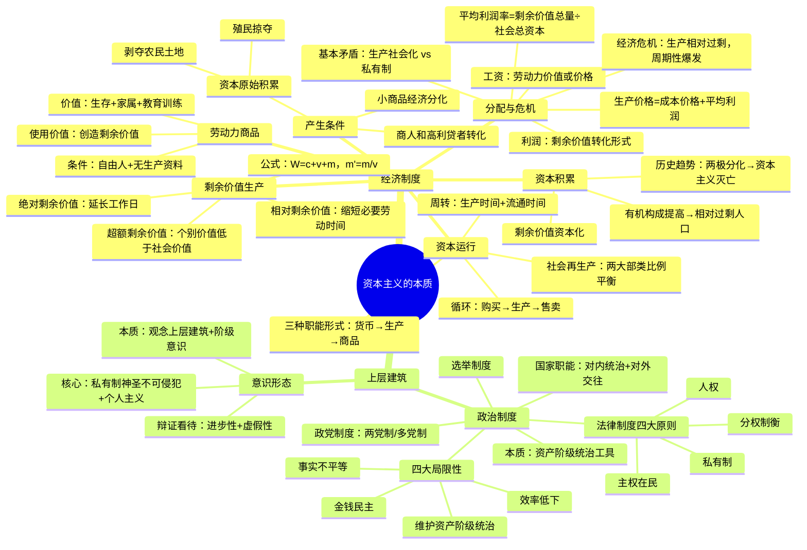

# 资本主义的本质 — Q&A 笔记

## 一、资本主义经济制度

### 1. 前资本主义社会形态的演进

❓ 前资本主义社会经历了哪些形态？

✅ 经历了三种社会形态的依次更替：
- **原始社会**：生产力极低，生产资料公有，共同劳动，平均分配。
- **奴隶社会**：奴隶主占有生产资料和奴隶本身，奴隶劳动全部归奴隶主所有。
- **封建社会**：地主占有土地，农民依附于土地，以地租形式剥削农民剩余劳动。

社会形态更替的根本动力是**生产力与生产关系的矛盾运动**。

---

### 2. 资本主义生产关系的产生

❓ 资本主义生产关系是怎样产生的？

✅ 主要通过**两个途径**从封建社会中萌芽：
1. **小商品经济分化**：小商品生产者因竞争分化，少数富裕者扩大生产规模，雇佣工人劳动，演变为资本家；多数破产者沦为雇佣工人。
2. **商人和高利贷者转化**：商人从控制购销渠道发展为直接支配生产（包买商）；高利贷者积累大量货币资本后投资设厂，转化为资本家。

---

### 3. 资本原始积累

❓ 什么是资本原始积累？主要内容是什么？

✅ **资本原始积累**：用**暴力手段**迫使生产者和生产资料分离，使货币资本迅速集中于少数人手中的历史过程。

两个主要途径：
1. **剥夺农民土地**（典型：英国的"圈地运动"）——使农民失去土地，被迫成为雇佣工人。
2. **殖民掠夺**——通过殖民扩张、奴隶贸易、掠夺金银等手段积累巨额货币财富。

资本原始积累是"用血和火的文字载入人类编年史的"。

---

### 4. 劳动力成为商品

❓ 劳动力成为商品需要什么条件？劳动力商品的价值和使用价值是什么？

✅ **两个基本条件**：
1. 劳动者是**自由人**，能支配自己的劳动力。
2. 劳动者**没有生产资料**，只能靠出卖劳动力为生。

**劳动力商品的价值**（三部分）：
1. 维持劳动者本人生存所必需的生活资料价值
2. 维持劳动者家属生存所必需的生活资料价值
3. 劳动者的教育和训练费用

**劳动力商品的使用价值**：劳动本身，它在消费过程中能创造价值，而且是**大于自身价值的价值**（即剩余价值）——这是劳动力商品的特殊性所在，是**剩余价值的源泉**。

---

### 5. 剩余价值的生产过程

❓ 剩余价值是如何生产出来的？

✅ 资本主义生产过程是**劳动过程与价值增殖过程的统一**。

劳动时间划分为：
- **必要劳动时间**：再生产劳动力价值的时间
- **剩余劳动时间**：为资本家生产剩余价值的时间

产品价值构成：**W = c + v + m**
- **c**（不变资本）：生产资料的价值，转移到产品中，不增殖
- **v**（可变资本）：劳动力价值，由工人劳动再生产出来
- **m**（剩余价值）：工人剩余劳动创造的超过劳动力价值的价值

**区分不变资本与可变资本**是马克思的重大贡献，揭示剩余价值的真正来源是可变资本。

❓ 剩余价值率如何计算？

✅ **剩余价值率 m' = m / v = 剩余劳动时间 / 必要劳动时间**

剩余价值率精确反映了**资本家对工人的剥削程度**。

---

### 6. 剩余价值生产的两种基本方法

❓ 绝对剩余价值与相对剩余价值有什么区别？

✅

| | 绝对剩余价值 | 相对剩余价值 |
|:---|:---|:---|
| **方法** | 延长工作日 / 提高劳动强度 | 缩短必要劳动时间（提高劳动生产率） |
| **实现手段** | 外延式增加劳动量 | 社会劳动生产率普遍提高，降低生活资料价值 |
| **结果** | 绝对延长剩余劳动时间 | 相对延长剩余劳动时间 |

❓ 什么是超额剩余价值？

✅ **超额剩余价值**：个别企业劳动生产率高于社会平均生产率，使其商品的**个别价值低于社会价值**，按社会价值出售后获得的额外剩余价值。

超额剩余价值的源泉是**本企业工人劳动生产率的提高**。它是相对剩余价值的基础——资本家的逐利行为推动全社会劳动生产率提高，最终形成相对剩余价值。

---

### 7. 资本积累

❓ 什么是资本积累？其后果是什么？

✅ **资本积累**：把剩余价值转化为资本，即**剩余价值的资本化**。它是资本主义**扩大再生产**的源泉。

资本积累的后果：
1. **资本有机构成提高**：随着技术进步，不变资本（c）相对可变资本（v）的比例不断提高，即**c : v 上升**。
2. **相对过剩人口**：机器排挤工人，劳动力供过于求，形成产业后备军。三种形态：
   - **流动的过剩人口**：时而被排斥、时而被吸收
   - **潜在的过剩人口**：农村剩余劳动力
   - **停滞的过剩人口**：就业极不稳定的劳动者
3. **两极分化**：一极是资产阶级财富积累，一极是无产阶级贫困积累。

❓ 资本积累的历史趋势是什么？

✅ 资本主义积累导致**生产社会化与生产资料私有制的矛盾日益尖锐**，最终导致**资本主义必然灭亡**——"剥夺者被剥夺"。

---

### 8. 资本循环与资本周转

❓ 资本循环有哪三个阶段和三种职能形式？

✅ **资本循环**的三个阶段：
1. **购买阶段**：用货币购买生产资料和劳动力 — 货币资本
2. **生产阶段**：生产资料和劳动力结合进行生产 — 生产资本
3. **售卖阶段**：出售商品实现价值和剩余价值 — 商品资本

三种**职能形式**：
- **货币资本**：为生产剩余价值准备条件
- **生产资本**：生产剩余价值
- **商品资本**：实现剩余价值

资本循环顺畅进行需要两个条件：**空间上并存**（三种职能形式按比例并存）+ **时间上继起**（三个阶段依次衔接）。

❓ 资本周转的关键因素是什么？

✅ **资本周转**：周而复始、不断重复的资本循环。

关键因素：
- **周转时间**（生产时间 + 流通时间）：越短越好
- **固定资本与流动资本的比例**：固定资本比重越大，周转越慢

加快资本周转可以为资本家带来更多剩余价值（年剩余价值量增加）。

---

### 9. 社会总资本再生产

❓ 社会总资本再生产的核心问题是什么？

✅ 核心问题是**社会总产品的实现问题**，包括：
1. **价值补偿**：产品必须卖得出去，收回资本价值
2. **实物补偿**：再生产所需的生产资料和消费资料必须在市场上买到

马克思将社会总产品分为**两大部类**：
- **第 I 部类**：生产资料生产
- **第 II 部类**：消费资料生产

两大部类之间和内部必须保持一定比例关系，社会总资本再生产才能顺利进行。这是**社会再生产的基本规律**。

---

### 10. 工资的本质

❓ 资本主义工资的本质是什么？

✅ 资本主义工资的本质是**劳动力的价值或价格**，但在现象上表现为"劳动的价格"，从而**掩盖**了必要劳动与剩余劳动、有酬劳动与无酬劳动的区分，掩盖了资本主义剥削关系。

---

### 11. 剩余价值→利润→平均利润→生产价格

❓ 剩余价值如何转化为利润和平均利润？

✅ 转化链条：
1. **剩余价值 → 利润**：剩余价值被看作全部预付资本的产物时，就转化为利润。利润掩盖了剩余价值的真实来源。
2. **利润 → 平均利润**：不同部门资本家通过**竞争和资本转移**，使等量资本获得等量利润，利润转化为平均利润。
3. **价值 → 生产价格**：**生产价格 = 成本价格 + 平均利润**。价值规律的作用形式变为：市场价格围绕生产价格波动。

**平均利润率 = 剩余价值总量 / 社会总资本**

平均利润理论揭示：工人不仅受本企业资本家剥削，还受**整个资产阶级的剥削**——无产阶级必须团结起来反对整个资产阶级。

---

### 12. 资本主义基本矛盾与经济危机

❓ 资本主义的基本矛盾是什么？

✅ **生产社会化与生产资料资本主义私有制之间的矛盾**。这是资本主义社会一切矛盾和冲突的根源。

具体表现为：
- 个别企业生产的有组织性与整个社会生产的无政府状态
- 生产的无限扩大趋势与劳动人民有支付能力的需求相对缩小

❓ 资本主义经济危机的本质和根源是什么？

✅ 经济危机的本质是**生产相对过剩**（不是绝对过剩，而是相对于有支付能力的需求而言）。危机的**根本原因**是资本主义基本矛盾。

经济危机的**周期性**：危机 → 萧条 → 复苏 → 高涨。危机是上一个周期的终点，也是下一个周期的起点。周期性爆发表明资本主义生产关系已经容纳不下生产力的发展。

---

## 二、资本主义上层建筑

### 13. 资本主义国家的职能与本质

❓ 资本主义国家的职能和本质是什么？

✅ 两大基本职能：
- **对内**：政治统治 + 社会管理
- **对外**：国际交往 + 维护国家安全和利益

**本质**：资本主义国家是**资产阶级统治的工具**，是维护资产阶级利益、对无产阶级和劳动人民实行专政的暴力机器。

---

### 14. 资本主义民主制度

❓ 资本主义政治制度的基本构成是什么？

✅

**法律制度**四大原则：
1. **私有制原则**：保护私有财产
2. **主权在民原则**：国家权力来源于人民
3. **分权制衡原则**：立法、行政、司法三权分立相互制衡
4. **人权原则**：维护公民基本权利

**选举制度**：定期选举产生国家政权机关，形式上赋予公民普遍选举权。

**政党制度**：两党制或多党制，通过竞选轮流执政。

❓ 如何评价资本主义政治制度？

✅

**历史进步性**：比封建专制进步，推动了人类政治文明发展。

**四大局限性**：
1. **金钱民主**：实质是资本操纵的民主，选举被金钱左右
2. **法律名义平等掩盖事实不平等**：法律面前人人平等掩盖了经济地位的不平等
3. **政党制维护资产阶级统治**：无论哪个政党上台，维护的都是资产阶级整体利益
4. **政党恶斗导致效率低下**：党派利益高于国家利益，相互掣肘

---

### 15. 资本主义意识形态

❓ 资本主义意识形态的核心内容是什么？

✅ 两个核心观念：
1. **私有制神圣不可侵犯**：将资本主义私有制说成天然合理、永恒不变
2. **个人主义价值观**：以个人为中心，强调个人权利和个人自由

❓ 资本主义意识形态的本质是什么？

✅ 两方面本质：
1. **作为观念上层建筑**：为资本主义经济基础服务，维护和巩固资本主义生产方式
2. **作为资产阶级阶级意识**：是资产阶级阶级利益的集中体现和理论化表达

❓ 如何辩证看待资本主义意识形态？

✅
- 在反封建斗争中起过**进步作用**（自由、平等、人权等口号动摇了封建专制统治）
- 但本质上维护剥削制度，具有**虚假性和欺骗性**
- 资本主义宣扬的自由、平等、民主在资本统治下无法真正实现
- 这些观念的合理内核被马克思主义**批判继承**，赋予其真正的人民性内涵

---

## 思维导图

