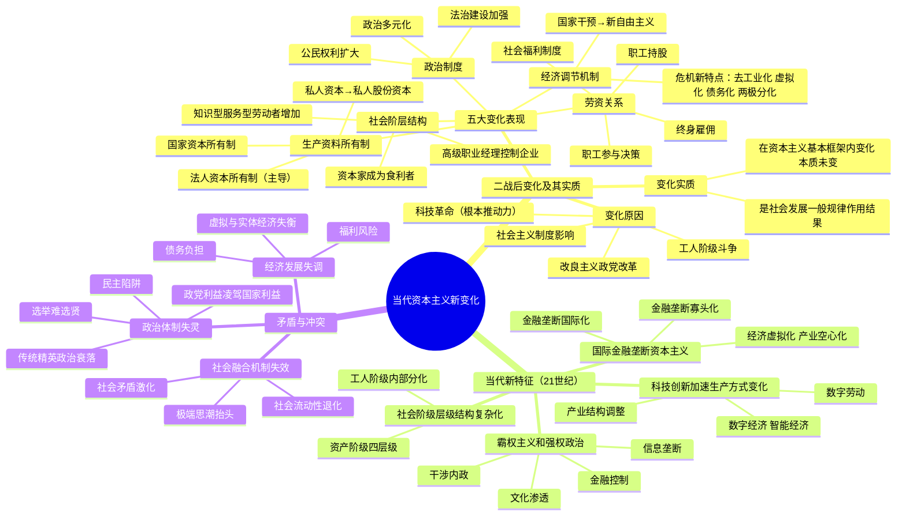

# 当代资本主义新变化

## 二战后资本主义变化及其实质

### ❓ 二战后资本主义在生产资料所有制方面发生了什么变化？

✅ **五大变化之一：生产资料所有制变化。** 经历了从私人资本所有制到私人股份资本所有制，再到国家资本所有制和法人资本所有制的发展历程。其中**法人资本所有制**已成为当代资本主义占主导地位的所有制形式，包括**企业法人**和**机构法人**两种形态。国家资本所有制则是国家直接占有生产资料并参与经济运行的重要形式。

### ❓ 二战后资本主义的劳资关系有哪些改善？

✅ **五大变化之二：劳资关系变化。** 主要表现为四个方面：**职工参与决策**（让工人在一定程度上参与企业管理）、**终身雇佣制**（日本等国推行的长期雇佣保障）、**职工持股计划**（让工人持有本企业股份）、**社会福利制度**的建立和完善。这些措施在一定程度上缓和了劳资矛盾，但并未改变雇佣劳动的本质。

### ❓ 二战后资本主义的社会阶层结构发生了什么变化？

✅ **五大变化之三：社会阶层结构变化。** 主要体现在三个趋势：第一，**资本家成为食利者**，退出直接生产过程，靠股息和利息为生；第二，**高级职业经理**成为企业实际控制者，形成"经理革命"；第三，**知识型和服务型劳动者**数量大幅增加，传统产业工人比重下降，白领阶层壮大。

### ❓ 二战后资本主义的经济调节机制经历了怎样的演变？

✅ **五大变化之四：经济调节机制变化。** 经历了从**国家干预**（凯恩斯主义）到**新自由主义**（市场原教旨主义）的转变。与此同时，经济危机呈现出新特点：**去工业化**（实体经济萎缩）、**经济虚拟化**（金融泡沫膨胀）、**债务化**（国家与私人债务高企）、**两极分化**（贫富差距持续扩大）。

### ❓ 二战后资本主义的政治制度发生了哪些变化？

✅ **五大变化之五：政治制度变化。** 主要表现为：**政治多元化**（多党竞争格局）、**公民权利扩大**（选举权普及、社会权利扩展）、**法治建设加强**（法律体系的完善和司法独立性的提升）。这些变化增强了资本主义政治制度的弹性和包容性。

### ❓ 二战后资本主义发生变化的根本原因是什么？

✅ **变化的四大原因：** 第一，**科技革命**和生产力发展是根本推动力（信息技术革命深刻改变了生产方式）；第二，**工人阶级**长期斗争迫使资产阶级做出让步；第三，**社会主义制度**优越性的示范压力和影响；第四，**改良主义政党**（社会民主党等）推动的社会改革。

### ❓ 如何认识二战后资本主义变化的实质？

✅ **变化实质的两方面：** 一方面，这些变化是**人类社会发展一般规律**作用的结果，体现了生产社会化程度提高的客观要求，包含了对资本主义的某种"扬弃"因素；另一方面，所有这些变化都是在**资本主义制度基本框架内**的变化，资本主义私有制、雇佣劳动、资本对利润的追求这些**本质特征并未改变**。

---

## 当代资本主义变化新特征（21世纪以来）

### ❓ 科技创新如何加速当代资本主义生产方式的变化？

✅ **四个新特征之一：科技创新加速生产方式变化。** 表现为三个方面：**产业结构加速调整**（传统制造业衰退、高新技术产业崛起）、**数字劳动**成为新型劳动形态（平台经济、零工经济）、**数字经济和智能经济**成为主导经济形态，数据成为关键生产要素，人工智能深刻重塑生产过程。

### ❓ 什么是国际金融垄断资本主义？

✅ **四个新特征之二：国际金融垄断资本主义。** 具有三个突出特点：**金融垄断寡头化**（少数金融巨头控制全球经济命脉）、**金融垄断国际化**（资本在全球范围自由流动和投机）、**经济虚拟化和产业空心化**（金融部门脱离实体经济自我膨胀，发达国家制造业大规模外移）。

### ❓ 当代资本主义社会的阶级结构发生了怎样的复杂变化？

✅ **四个新特征之三：社会阶级层级结构复杂化。** 资产阶级内部出现四个层级分化（顶级富豪阶层、大企业高管阶层、中小企业主阶层、食利者阶层）。与此同时，**工人阶级内部分化**加剧：高端技术工人与低端服务业劳动者之间收入、地位差距悬殊，工人阶级的统一性和团结性受到削弱。

### ❓ 当代资本主义霸权主义有哪些新表现？

✅ **四个新特征之四：霸权主义和强权政治。** 以美国为首的西方发达国家通过四种手段维持全球霸权：**金融控制**（美元霸权、国际金融机构操控）、**文化渗透**（输出价值观和生活方式）、**信息垄断**（控制全球信息传播渠道和话语权）、**干涉内政**（以人权、民主为名干预他国内政，推行颜色革命和政权更迭）。

---

## 世界大变局下资本主义矛盾与冲突

### ❓ 当代资本主义经济发展失调表现在哪些方面？

✅ **三大问题之一：经济发展失调。** 主要表现为三个层面：第一，**虚拟经济与实体经济严重失衡**（金融泡沫膨胀而制造业空心化）；第二，**福利风险**日益突出（高福利制度的不可持续性）；第三，**债务负担**沉重（主权债务危机频发，国家、企业和个人债务全面高企）。

### ❓ 当代资本主义政治体制失灵体现在哪些方面？

✅ **三大问题之二：政治体制失灵。** 体现为四种困境：**选举难选贤**（金钱政治导致选举腐败、民粹领袖上台）、**政党利益凌驾国家利益**（党派斗争极化、政治极化严重）、**民主陷阱**（形式民主掩盖实质不民主、民众政治冷漠）、**传统精英政治衰落**（建制派公信力丧失、反体制力量崛起）。

### ❓ 当代资本主义社会融合机制为何失效？

✅ **三大问题之三：社会融合机制失效。** 表现在三个方面：**极端思潮抬头**（民粹主义、种族主义、排外主义蔓延）、**社会流动性退化**（阶层固化、"寒门难出贵子"）、**社会矛盾激化**（种族冲突、宗教冲突、阶级矛盾交织，社会撕裂加剧）。

---

## 思维导图

