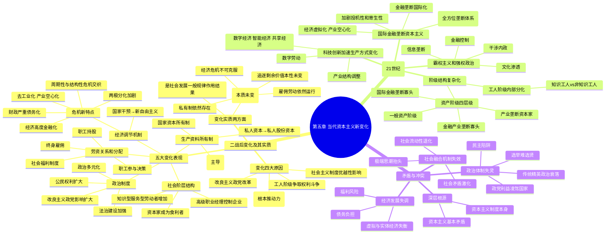

# 第五章 资本主义的发展及其趋势

## 第二节 正确认识当代资本主义的新变化

### 一、第二次世界大战后资本主义的变化及其实质 *

#### （一）变化的主要表现

##### 1. 生产资料所有制的变化 **【世界观】

资本主义生产资料所有制的演进脉络：

| 阶段 | 所有制形式 | 核心特点 |
|:-----|:-----------|:---------|
| **资本主义初期** | 私人资本所有制 | 所有权与控制权统一于资本家自身，个体资本家直接支配和剥削雇佣劳动者 |
| **19 世纪末—20 世纪初** | 私人股份资本所有制 | 资本占有主体多元化、使用整体性；所有权与控制权**分离**，职业经理人掌握控制权 |
| **二战后** | 国家资本所有制 + **法人资本所有制**（主导） | 见下方详述 |

**国家资本所有制**：
- 生产资料由国家占有，服务于垄断资本
- 主要存在于**基础设施和公共事业部门**，比重不大但影响重要
- 性质仍是资本主义形式，体现总资本家剥削雇佣劳动者的关系

**法人资本所有制**（当代主导形式）**：
- 法人（企业法人 + 机构法人）取代个人/家族股东成为主要出资人
- 股票高度集中于少数法人股东之手 → 所有权与控制权**重新趋于合一**
- 两种形式：企业法人资本所有制 + 机构法人资本所有制
- 性质：基于资本雇佣劳动的**垄断资本集体所有制**

趋势总结：资本占有的**社会化程度大大提高**。

---

##### 2. 劳资关系和分配关系的变化 *【世界观】

从"形式上隶属"到"实质上隶属"（机器大工业后），资本家采取缓和劳资关系的激励制度：

| 制度 | 内容 |
|:-----|:-----|
| **职工参与决策** | 监事会中劳资双方各半，协调劳资关系 |
| **终身雇佣** | 不违反纪律即终身雇佣，增强归属意识（日本典型） |
| **职工持股** | 工人持有本公司股份，调动积极性 |
| **社会福利制度** | 普及化、全民化，保障最低生活水平，改善生活状况 |

> 这些是资本主义发展到国家垄断资本主义阶段对分配关系的新调整，工人阶级生活状况得到**一定程度**改善，但雇佣劳动本质未变。

---

##### 3. 社会阶层和阶级结构的变化 *【世界观】

三大趋势：

| 变化 | 内容 |
|:-----|:-----|
| **资本家成为食利者** | 所有权与控制权分离 → 资本家靠股票等有价证券利息为生，不直接经营企业 |
| **高级职业经理控制企业** | 享有优厚薪金和职务津贴，控制企业决策、生产、人事 → 与企业所有者利益高度一致 |
| **知识型和服务型劳动者增加** | 蓝领越来越少、白领越来越多；物质生产部门就业减少、服务业大幅上升；劳动方式从传统向现代转变 |

---

##### 4. 经济调节机制和经济危机形态的变化 **【世界观】

**调节机制的演变**：

| 时期 | 主导思想 | 特点 |
|:-----|:---------|:-----|
| 二战后初期 | **国家干预**（凯恩斯主义） | 全面干预经济：增长、就业、稳定、福利、市场秩序 |
| 1970 年代起 | **新自由主义** | 强化市场、弱化政府：国企私有化、福利改革、放松管制 |

**经济危机新特点** **：

- 去工业化和产业空心化日趋严重，产业竞争力下降
- 经济高度金融化，虚拟经济与实体经济严重脱节
- 财政严重债务化，债务危机频繁爆发
- 两极分化和社会对立加剧
- 经济增长乏力，周期性与结构性危机交织
- 金融危机频发（如 2008 年国际金融危机）

---

##### 5. 政治制度的变化 *【世界观】

- **政治多元化**：公民通过个人或团体、政党等渠道影响国家政策
- **公民权利扩大**：选举权普及、社会权利扩展
- **法治建设加强**：国家权力行使纳入法治范围
- **改良主义政党影响扩大**：成为二战后西方政治生活中的突出现象

---

#### （二）变化的原因和实质 ***

##### 变化四大原因 **【世界观】

| 原因 | 要旨 |
|:-----|:-----|
| **科学技术革命和生产力的发展**（根本推动力）*** | 第三次科技革命极大促进生产力：1951—1975 年主要资本主义国家劳动生产率年均增长 2.6%—8.8%；第三产业比重 1999 年达 60%—70%+ |
| **工人阶级争取自身权利和利益的斗争**（重要力量）** | 1950—1969 年各国年均罢工数百次，迫使资产阶级让步和改革 |
| **社会主义制度初步显示的优越性**（重要影响）** | 社会主义阵营扩大 → 对资本主义构成挑战 → 促使资产阶级改良（计划化管理、职工参与等） |
| **主张改良主义的政党对资本主义制度的改革**（重要作用）* | 在不触动基本经济制度的前提下对生产关系个别环节改良（国有化、计划调控、倡导公平等） |

---

##### 变化实质两方面 ***【世界观】

**第一，从根本上说是人类社会发展一般规律和资本主义经济规律作用的结果**。

科学技术进步 + 生产社会化程度提高 → 必然要求调整和变革不适应生产力发展的旧生产关系 → 这是资本主义生产方式为**适应生产力发展要求而作出的自我调节**。

**第二，变化是在资本主义制度基本框架内的变化，并不意味着资本主义生产关系的根本性质发生了变化**。

| 未改变的方面 | 具体说明 |
|:-------------|:---------|
| **生产资料私有制** | 依然是资本主义的基本经济制度 |
| **雇佣劳动制度** | 依然存在并运行 |
| **资本追逐剩余价值的本性** | 改变的是方式和方法，本性未变 |
| **资本的社会支配地位** | 占有的社会性提高，但支配地位未根本改变 |
| **剥削与反剥削斗争** | 传统工人阶级分化，但资本与新型劳工阶层之间的斗争依然进行 |
| **财富两极分化的制度基础** | 社会福利制度有所缓和，但导致两极分化的制度基础未改变 |
| **经济危机** | 根源于资本主义基本矛盾的经济危机依然是不可克服的痼疾 |

> 核心结论：**变化没有改变资本主义制度的本质，没有克服资本主义的基本矛盾，没有改变马克思主义关于资本主义的基本论断的科学性**。

---

### 二、当代资本主义变化的新特征（21 世纪以来）**

#### 1. 科技创新加速资本主义生产方式变化 **【世界观】

以信息数字技术、人工智能、生物技术等为代表的新一轮科技革命推动资本主义生产方式向**数字化、智能化**方向发展：

| 方面 | 表现 |
|:-----|:-----|
| **产业结构调整** | 去工业化 + 经济虚拟化 + 金融化；一般制造业占比下降，高新技术产业和金融业占比上升 |
| **生产组织和劳动形式变化** | 数据成为新生产要素；数字劳动（数据生产、管理、服务的在线化和智能化）地位突出 |
| **新经济形态出现** | **数字经济、智能经济、共享经济**成为全球经济发展新形态 |

---

#### 2. 国际金融垄断资本主义影响日益显现 ***【世界观】

**三大突出特征**：

| 特征 | 内容 |
|:-----|:-----|
| **金融垄断寡头化** ** | 超出一国经济领域，形成涵盖市场、资源、高科技、军事技术、新闻、话语的**全方位垄断体系** → 财富向少数金融寡头积聚，形成更绝对的统治地位 |
| **金融垄断国际化** ** | 凭借金融、技术、军事优势 + 国际组织主导地位 → 超巨型跨国公司控制国际产业链、贸易链和优势产业 |
| **经济虚拟化、产业空心化** ** | 经济日益证券化、数字化、虚拟化，实体经济迅速衰退；庞大金融机构体系强化对经济的控制和吸血，加剧资本主义的**投机性和寄生性** |

> 1960—2020 年美国数据：金融业占比 14% → 21%，制造业占比 27% → 11%；金融业利润从 17% → 30%+，制造业利润从 49% → 10.6%；1947—2012 年美国 GDP 增长 63 倍，制造业增长 30 倍，金融业增长 **212 倍**。

---

#### 3. 社会阶级层级结构呈现复杂性、多样化 **【世界观】

**资产阶级内部四层级**：

| 层级 | 构成 |
|:-----|:-----|
| 最高层 | 极少数**国际金融垄断寡头**阶层 |
| 第二层 | 国际金融—产业垄断寡头（能源、军工、高科技利益集团） |
| 第三层 | 占据各产业垄断地位的**产业垄断资本家** |
| 第四层 | 经理资本家、食利者、中小企业资本家等**一般资产阶级** |

**工人阶级内部分化**：
- 传统技能被智能化、自动化取代
- "知识工人"数量和增速均超过"非知识工人"
- 工人阶级内部因技能、收入差异逐渐分化，统一性和团结性被削弱

---

#### 4. 发达资本主义国家推行霸权主义和强权政治 **【世界观】

| 手段 | 内容 |
|:-----|:-----|
| **金融控制** | 利用强大金融资本控制国际投资、生产、流通、交换、贸易、市场，对发展中国家进行最大限度经济盘剥 |
| **文化渗透** | 利用文化产业体系和传播媒介垄断权，输出资本主义价值观和"西式民主文化"，威胁民族文化认同 |
| **信息/技术垄断** | 利用知识产权和信息技术垄断，制造"信息鸿沟""数字鸿沟""技术鸿沟"，构建"信息帝国主义""数字帝国主义" |
| **干涉内政** | 利用集团政治操纵国际组织，把自己意志和规则强加于人，进行全方位制裁 |

> 结论：21 世纪以来资本主义新变化并未改变其**经济基础和追求利润最大化的本性**，在拓展发展空间的同时放大了**系统性危机**，不断暴露弊端与困境。

---

### 三、世界大变局下资本主义的矛盾与冲突 *

#### 1. 经济发展失调 *【世界观】

2008 年国际金融危机以来，西方主要资本主义国家经济发展面临三大问题：

| 问题 | 表现 |
|:-----|:-----|
| **虚拟经济与实体经济发展失衡** | 金融业以高于实体经济数倍速度膨胀，严重脱节，实体经济空心化 → 削弱内生增长能力 |
| **福利风险增加** | 高福利下部分人失去工作意愿；人口老龄化 + 金融危机后财政不堪重负 |
| **债务负担沉重** | 借债消费习惯 + 高支出福利 + 救市措施 → 政府债务不断攀升 → 埋下新一轮金融危机隐患 |

---

#### 2. 政治体制失灵 *【世界观】

| 失灵表现 | 核心内容 |
|:---------|:---------|
| **选举难以选贤** | 考察的是选举能力而非治国能力，能说会道即可当选 |
| **政党利益凌驾国家利益** | "你方唱罢我登场"的钟摆效应；"否决政治"盛行 → 政治极化和朝野矛盾加剧 |
| **民主陷阱阻碍治理** | 政府决策短视化；少数人以民主名义绑架社会公益，重大项目"胎死腹中" |
| **传统精英政治衰落** | 经济长期萎靡 + 贫富差距扩大 + 民众不满 → 精英治国失灵 → 民粹主义泛起 |

---

#### 3. 社会融合机制失效 *【世界观】

| 表现 | 内容 |
|:-----|:-----|
| **社会极端思潮抬头** | 经济危机 + 移民问题 → 右翼政党"登堂入室"，排外主义、种族主义蔓延 |
| **社会流动性退化** | 贫富差距不断扩大，中产阶层萎缩，阶层固化：美国前 1% 富人拥有 27% 国家财富，中产 60% 占比跌至 27%（2021 年） |
| **社会矛盾激化** | 群体性事件频发：2021 年美国国会山骚乱（5 死 140+ 伤），2022 年法国多地大规模示威演变为骚乱 |

---

**深层根源** ***【世界观】：归根结底在于**资本主义制度本身**，在于**资本主义的基本矛盾**（生产社会化与生产资料资本主义私人占有之间的矛盾）。

---

## 思维导图

