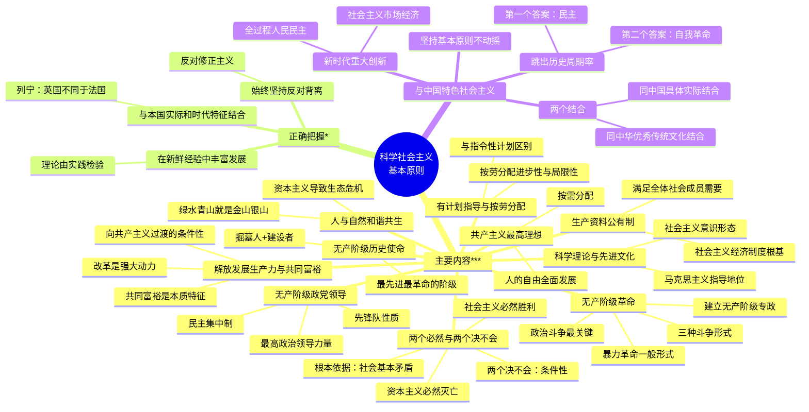

# 第二节 科学社会主义基本原则

> 科学社会主义基本原则是社会主义事业发展规律的集中体现，是马克思主义政党领导人民进行社会主义革命、建设、改革的基本遵循。必须始终坚持科学社会主义基本原则，同时从本国实际出发不断进行丰富和发展。

---

## 一、科学社会主义基本原则的主要内容 ***

马克思、恩格斯在创立科学社会主义理论并用以指导国际工人运动的过程中，逐步形成了科学社会主义基本原则。这些原则在后来的社会主义革命和建设中得到了证实、丰富和发展。

### 第一，"两个必然"与"两个决不会" ***

**定义**："资本主义必然灭亡，社会主义必然胜利"是科学社会主义的核心命题。《共产党宣言》明确提出："资产阶级的灭亡和无产阶级的胜利是同样不可避免的。"

- **根本依据是社会基本矛盾**：资本主义生产方式的基本矛盾——生产社会化与生产资料资本主义私人占有之间的矛盾——具有固有性、不可克服性、不可抗拒性，决定了资本主义必然被更先进的社会主义和共产主义所代替。
- **"两个决不会"揭示条件性**：马克思指出，"无论哪一个社会形态，在它所能容纳的全部生产力发挥出来以前，是决不会灭亡的；而新的更高的生产关系，在它的物质存在条件在旧社会的胎胞里成熟以前，是决不会出现的。"
  - 强调社会形态更替需要相应的历史条件
  - 必须将"两个必然"与"两个决不会"联系起来全面把握

### 第二，无产阶级是最先进最革命的阶级 ***

**定义**：无产阶级是社会化大生产的产物，是先进生产力的代表，肩负着推翻资本主义旧世界、建立社会主义和共产主义新世界的历史使命。

- **最先进**：社会化大生产产物 + 先进生产力代表 + 高度组织纪律性
- **最革命**：处于资本主义社会最底层，受到的剥削和压迫最深，革命最坚决、最彻底
- **"掘墓人"和建设者**：只有无产阶级才能作为革命的领导阶级，带领广大人民群众推翻旧世界、建设新世界
- 无产阶级不是一成不变的，随社会发展不断实现自身变化

### 第三，无产阶级革命是最高斗争形式 ***

**定义**：无产阶级革命是以政治革命为核心的社会革命，根本问题是国家政权问题，以建立无产阶级专政为目的。

- **三种斗争形式**：
  1. 经济斗争——改善劳动和生活条件
  2. 政治斗争——争取政治权利特别是夺取政权（**最关键**）
  3. 思想斗争——反对资产阶级意识形态控制
- **暴力革命是一般形式**：无产阶级革命总会遇到反革命的暴力镇压，但不排除特定情况下和平取得政权的可能性
- **必须打碎旧的国家机器**：不能简单照搬和运用资产阶级国家机器，必须建立无产阶级专政的新型国家政权
  - 无产阶级专政在整个社会主义社会都必须坚持
  - 任务：镇压剥削阶级反抗 + 防御外敌入侵 + 领导和组织国家建设 + 发展社会主义民主
- **人民当家作主**是社会主义民主政治的本质特征，全过程人民民主是最广泛、最真实、最管用的民主

### 第四，在生产资料公有制基础上组织生产 ***

**定义**：生产资料公有制是社会主义经济制度的根基，社会主义生产的根本目的是满足全体社会成员的需要。

- **私有制是资本主义罪恶的总根源**：无产阶级夺取政权后，要利用自己的政治统治，建立社会主义公有制，并尽快增加生产力的总量
- **生产目的的根本转变**：
  - 资本主义：资本增殖（由私有制决定）
  - 社会主义：满足全体社会成员的需要（由公有制决定）
- 社会主义社会是以人民为中心的社会，实现好、维护好、发展好最广大人民根本利益是一切工作的出发点和落脚点
- 各国应根据生产力发展水平和要求，探索公有制的具体实现形式

### 第五，有计划指导和调节社会生产，实行按劳分配 ***

**定义**：社会主义社会要有计划地指导和调节社会生产，实行"各尽所能，按劳分配"原则。

- **与指令性计划经济的区别**：马克思、恩格斯所讲的有计划组织生产是一般性原则，不能与指令性计划经济画等号。经济文化相对落后国家进入社会主义后，必须正确处理计划与市场的关系，单一计划经济忽略或排斥市场不利于生产力发展
- **按劳分配的进步性**：打破资本主义"按资分配"原则，第一次以劳动作为分配标准（历史性进步）
- **按劳分配的局限性**：
  - 默认"劳动者的不同等的个人天赋"是"天然特权"，导致收入分配差距
  - 撇开人的社会生活的丰富性，只把人当作"劳动者"看待
  - 所体现的平等权利"还是被限制在一个资产阶级的框框里"
  - 但在共产主义第一阶段（社会主义）无法避免

### 第六，人与自然和谐共生 ***

**定义**：人类在改造自然的过程中要始终保持对自然规律的敬畏，社会主义社会要实现人与自然的和谐共生。

- **资本主义导致生态危机**：大规模生态破坏和环境污染是从资本主义条件下的工业化开始的，资本主义制度是造成生态问题的根本原因，变革资本主义制度是解决生态问题的根本途径
- **恩格斯的警告**："我们不要过分陶醉于我们人类对自然界的胜利。对于每一次这样的胜利，自然界都对我们进行报复。"
- **人与自然是生命共同体**：尊重自然、顺应自然、保护自然，牢固树立和践行"绿水青山就是金山银山"的理念，保持人与自然之间的动态平衡

### 第七，坚持科学理论指导，大力发展先进文化 ***

**定义**：马克思主义是社会主义国家的根本指导思想，社会主义先进文化是凝聚和激励人民的重要力量。

- **马克思主义指导地位**：恩格斯指出，"我们党有个很大的优点，就是有一个新的科学的世界观作为理论的基础。"在社会主义国家，马克思主义是立党立国、兴党兴国的根本指导思想
- **社会主义文化建设的根本**：在全社会培育和形成共同的理想信念、价值理念和道德观念
- **基本任务**：
  - 以马克思主义为指导，以社会主义价值取向引领社会风尚
  - 大力发展教育、科学和文化事业，满足人民精神文化需要
  - 积极吸收各国文化长处，同时坚决抵制各种腐朽思想文化的侵蚀
  - 建设具有强大凝聚力和引领力的社会主义意识形态
  - 牢牢掌握意识形态工作的领导权、管理权、话语权

### 第八，无产阶级政党是先锋队 ***

**定义**：无产阶级政党由无产阶级的先进分子组成，以科学理论武装，实行民主集中制，是社会主义事业的组织者和领导力量。

- **先锋队的内涵**：
  - 由无产阶级先进分子组成，是各国工人运动中最坚决、始终推动运动前进的力量
  - 以科学理论武装，"了解无产阶级运动的条件、进程和一般结果"
  - 具有坚定的社会主义和共产主义理想信念
  - 实行**民主集中制**，依靠统一的纲领和严格的纪律形成强大的组织力量
- **党的领导是最高政治领导力量**：社会主义事业是一个有组织有领导的自觉过程，必须始终坚持共产党的领导，这是取得成功的根本保证和关键所在
- 必须努力探索和掌握**共产党执政规律**，不断改善党的领导和提高党的执政能力

### 第九，解放发展生产力，实现共同富裕，向共产主义过渡 ***

**定义**：社会主义社会要大力解放和发展生产力，逐步消灭剥削和消除两极分化，实现共同富裕和社会全面进步，并最终向共产主义社会过渡。

- **解放和发展生产力**：只有创造出比资本主义更高的劳动生产率，才能体现社会主义本质，彰显优越性
- **改革是强大动力**：恩格斯指出，"所谓'社会主义社会'不是一种一成不变的东西，而应当和任何其他社会制度一样，把它看成是经常变化和改革的社会。"改革是社会主义制度的自我完善和发展
- **共同富裕是本质特征**：邓小平指出，"社会主义最大的优越性就是共同富裕，这是体现社会主义本质的一个东西。"
- **向共产主义过渡的条件性**：只有在充分发展和高度发达的基础上才能向共产主义过渡，条件不充分时急于过渡无益且有害

### 第十，共产主义是最高理想 ***

**定义**：共产主义是人类最美好的社会制度，实现共产主义是共产党人的最高理想和不懈追求。

- **共产主义社会的基本特征**：
  - 物质财富极大丰富，消费资料按需分配
  - 社会关系高度和谐，人们精神境界极大提高
  - 每个人自由而全面的发展，人类从必然王国向自由王国的飞跃
- 实现共产主义并不意味着人类历史的终结，而是人类真正自觉创造历史的开端
- 对马克思主义的信仰，对社会主义和共产主义的信念，是**共产党人的政治灵魂**，是共产党人经受住任何考验的精神支柱

---

## 二、正确把握科学社会主义基本原则 *

马克思、恩格斯在《共产党宣言》1872 年德文版序言中指出："不管最近 25 年来的情况发生了多大的变化，这个《宣言》中所阐述的一般原理整个说来直到现在还是完全正确的。……这些原理的实际运用，正如《宣言》中所说的，随时随地都要以当时的历史条件为转移。"

### （一）必须始终坚持，反对背离 *

- 科学社会主义基本原则揭示了资本主义生产方式的基本矛盾，阐明了社会主义代替资本主义的历史必然性
- 不能因遇到一时困难和挑战而放弃这些原则，否则就是背离社会主义运动的目的和无产阶级政党的宗旨，走向邪路
- **反对修正主义**：列宁深刻揭示修正主义的实质——"临时应付，迁就眼前的事变，迁就微小的政治变动，忘记无产阶级的根本利益……为了实际的或假想的一时的利益而牺牲无产阶级的根本利益"
- 马克思主义必须随着时代的发展而发展，但发展必须以坚持基本原则为前提

### （二）与本国实际和时代特征相结合 *

- 科学社会主义基本原则揭示的是一般性规律，而不是提供解决特殊问题的具体方案
- 列宁强调：马克思的理论"所提供的只是总的指导原理，而这些原理的应用具体地说，在英国不同于法国，在法国不同于德国，在德国又不同于俄国"
- 必须正确认识和处理原则的一般性与具体实际的特殊性之间的辩证关系

### （三）在总结新鲜经验中丰富发展 *

- 理论来源于实践，又随着实践的发展而发展
- 列宁指出："现在一切都在于实践，现在已经到了这样一个历史关头：理论在变为实践，理论由实践赋予活力，由实践来修正，由实践来检验"
- 不能"为死教条而牺牲活的马克思主义"
- 科学社会主义基本原则不是一成不变的教条，而是随着社会主义实践而不断丰富和发展的学说

---

## 三、科学社会主义基本原则与中国特色社会主义

### 中国特色社会主义始终坚持科学社会主义基本原则不动摇

- 中国特色社会主义是科学社会主义在中国的运用和发展，是扎根中国大地的科学社会主义
- 之所以是社会主义而不是别的什么主义，就是因为始终坚持科学社会主义基本原则不动摇
- 中国特色社会主义道路、理论、制度、文化都体现着科学社会主义基本原则，以新的独创性观点丰富和发展了老祖宗

### "两个结合"赋予鲜明的民族特色和时代特色

1. **同中国具体实际相结合**：运用马克思主义科学的世界观和方法论解决中国的问题，坚持解放思想、实事求是、与时俱进、求真务实，不断回答中国之问、世界之问、人民之问、时代之问
2. **同中华优秀传统文化相结合**：中华优秀传统文化蕴含的天下为公、民为邦本、为政以德、革故鼎新、天人合一、自强不息、厚德载物等，同科学社会主义价值观主张具有高度契合性

### 新时代中国特色社会主义的重大创新

- 坚定"两个必然"信念，牢记江山就是人民、人民就是江山
- 坚持公有制为主体、多种所有制经济共同发展，按劳分配为主体、多种分配方式并存，社会主义市场经济体制
- 全面发展**全过程人民民主**，社会主义民主政治制度化、规范化、程序化全面推进
- 坚持马克思主义在意识形态领域指导地位的根本制度
- 坚持人与自然和谐共生，取得社会主义生态文明建设新成就
- 坚持和加强**中国共产党的全面领导**，发挥党总揽全局、协调各方的领导核心作用

### 跳出"历史周期率"的两个答案

- **第一个答案——民主**（毛泽东，抗日战争时期）：只有让人民来监督政府，政府才不敢松懈；只有人人起来负责，才不会人亡政息
- **第二个答案——自我革命**（习近平，新时代）：党找到了自我革命这一跳出治乱兴衰历史周期率的第二个答案，自我净化、自我完善、自我革新、自我提高能力显著增强

---

## Mermaid 思维导图

