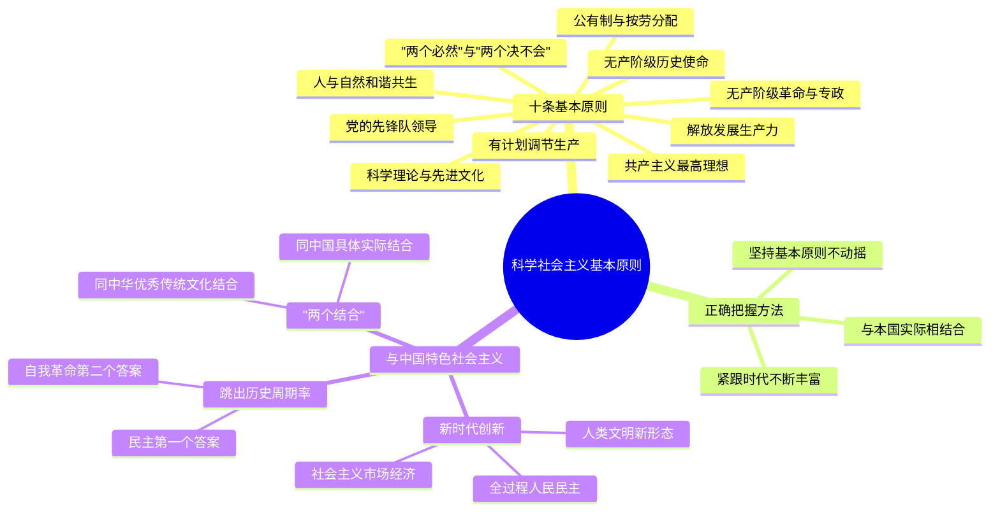

# 科学社会主义基本原则

## 一、科学社会主义基本原则的主要内容

### 十条基本原则

---

❓ **什么是"两个必然"和"两个决不会"？**

✅ **"两个必然"** 指资本主义必然灭亡、社会主义必然胜利，这是马克思、恩格斯在《共产党宣言》中揭示的历史发展总趋势。**"两个决不会"** 是马克思在《政治经济学批判序言》中提出的：无论哪一个社会形态，在它所能容纳的全部生产力发挥出来以前，是决不会灭亡的；而新的更高的生产关系，在它的物质存在条件在旧社会的胎胞里成熟以前，是决不会出现的。"两个决不会"强调了社会形态更替的条件性，与"两个必然"共同构成科学完整的理论。

---

❓ **无产阶级的历史使命是什么？**

✅ 无产阶级是最先进、最革命的阶级，肩负着**推翻资本主义旧世界、建立社会主义和共产主义新世界**的伟大历史使命。无产阶级与社会化大生产相联系，代表先进生产力；它处于社会最底层，受剥削最重，最具革命彻底性；只有解放全人类，才能最终解放自己。

---

❓ **无产阶级革命的最高斗争形式和目标是什么？**

✅ 无产阶级革命是**无产阶级进行斗争的最高形式**，以**建立无产阶级专政**为目的。斗争形式包括三种：
- **经济斗争**：争取改善劳动条件和物质利益
- **政治斗争**：推翻资产阶级统治（最高形式）
- **思想斗争**：批判资产阶级意识形态，传播科学社会主义

暴力革命是无产阶级革命的一般形式，但也不排除和平过渡的可能性。

---

❓ **社会主义生产的组织方式和根本目的是什么？**

✅ 社会主义必须在**生产资料公有制基础上组织生产**，满足**全体社会成员的需要**是社会主义生产的根本目的。生产资料公有制是社会主义经济制度的基础，与资本主义私有制根本对立，它消除了剥削的经济根源，使生产从追求剩余价值转向满足社会需要。

---

❓ **社会主义社会如何调节生产和分配？**

✅ 社会主义社会对生产进行**有计划的指导和调节**，实行**按劳分配原则**。需要区分的是：科学社会主义的计划调节不等于苏联模式的指令性计划经济。指令性计划经济是特定历史条件下的具体形式，而计划调节是社会化大生产的客观要求。按劳分配即多劳多得、少劳少得，是社会主义阶段的分配原则，区别于共产主义阶段的按需分配。

---

❓ **社会主义如何对待人与自然的关系？**

✅ 社会主义强调**合乎自然规律地改造和利用自然**，实现**人与自然和谐共生**。资本主义生产方式以无限追求利润为动力，必然导致对自然资源的掠夺性开发和生态危机。社会主义克服了这一弊端，将发展生产与保护生态统一起来。

---

❓ **社会主义文化建设的要求是什么？**

✅ 必须**坚持科学理论指导**，大力发展**社会主义先进文化**。以马克思主义为指导，培育和践行社会主义核心价值观，继承人类一切优秀文化成果，建设具有强大凝聚力和引领力的社会主义意识形态。

---

❓ **无产阶级政党在社会主义事业中的地位是什么？**

✅ **无产阶级政党**是无产阶级的**先锋队**，社会主义事业必须**始终坚持党的领导**。党由无产阶级先进分子组成，以科学理论武装，代表最广大人民根本利益，是社会主义事业的领导核心。没有党的坚强领导，社会主义事业就会失去方向。

---

❓ **社会主义的根本任务和最终目标是什么？**

✅ 社会主义必须**大力解放和发展生产力**，**消灭剥削、消除两极分化**，最终实现**共同富裕**，并向**共产主义社会过渡**。生产力是社会发展的最终决定力量，只有生产力高度发展，才能为消灭阶级、实现共产主义创造物质条件。

---

❓ **共产主义是什么样的社会？共产党人的最高理想是什么？**

✅ **共产主义**是人类最美好、最理想的社会制度，其基本特征是：物质财富极大丰富、人民精神境界极大提高、每个人自由而全面发展。实现共产主义是**共产党人的最高理想和最终奋斗目标**。社会主义是共产主义的初级阶段，中国特色社会主义是社会主义的一个发展阶段。

---

## 二、正确把握科学社会主义基本原则

---

❓ **如何正确把握科学社会主义基本原则？**

✅ 必须遵循三条方法指导：

1. **必须始终坚持，反对背离**：科学社会主义基本原则不能动摇，要旗帜鲜明地反对修正主义。如伯恩施坦修正主义主张"运动就是一切，最终目的是微不足道的"，实质是否定共产主义目标。

2. **善于与本国实际和时代特征相结合**：列宁指出，在英国不同于法国，在法国不同于德国，在德国不同于俄国，必须根据各国国情灵活运用。不存在普遍适用的单一模式。

3. **紧跟时代和实践发展，不断丰富发展**：科学社会主义是开放的理论体系，必须在实践中与时俱进，用新的思想、观点、论断丰富和发展基本原则。

---

## 三、科学社会主义基本原则与中国特色社会主义

---

❓ **中国特色社会主义与科学社会主义基本原则是什么关系？**

✅ 中国特色社会主义**坚持科学社会主义基本原则不动摇**。中国特色社会主义既坚持了科学社会主义基本原则，又根据时代条件赋予其鲜明的中国特色。它不是别的什么主义，而是科学社会主义在中国的具体实现形式。

---

❓ **什么是"两个结合"？**

✅ **"两个结合"** 指：
- **第一个结合**：马克思主义基本原理同**中国具体实际**相结合
- **第二个结合**：马克思主义基本原理同**中华优秀传统文化**相结合

"两个结合"是我们在探索中国特色社会主义道路中得出的规律性认识，体现了马克思主义中国化时代化的根本要求，使中国特色社会主义具有深厚的历史底蕴和文化根基。

---

❓ **新时代中国特色社会主义有哪些重大创新？**

✅ 新时代中国特色社会主义提出了一系列重大创新理论和实践：
- **全过程人民民主**：全链条、全方位、全覆盖的民主，实现过程民主与成果民主相统一
- **社会主义市场经济**：社会主义制度与市场经济的有机结合，既发挥市场在资源配置中的决定性作用，又更好发挥政府作用
- **人类文明新形态**：中国式现代化创造的人类文明新形态，拓展了发展中国家走向现代化的途径
- 此外还包括共同富裕、生态文明、人类命运共同体等重大创新

---

❓ **如何跳出"历史周期率"？两个答案是什么？**

✅ 跳出**"历史周期率"**——即政权兴亡的周期规律，我们党给出了两个答案：

1. **第一个答案：民主**。1945年毛泽东在延安窑洞对话中提出"让人民来监督政府"，这是民主新路。

2. **第二个答案：自我革命**。新时代提出，经过不懈努力，党找到了**自我革命**这一跳出治乱兴衰历史周期率的第二个答案，确保党永远不变质、不变色、不变味。

---

## 思维导图

