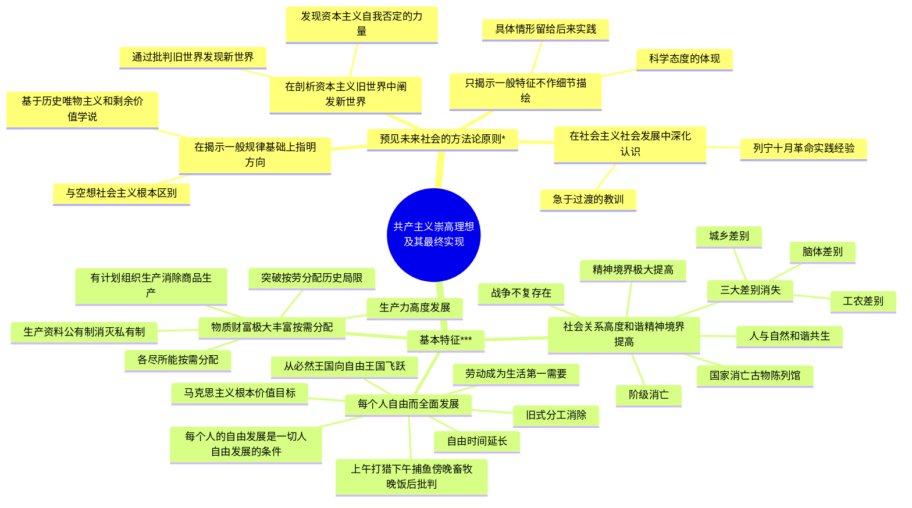

# 第一节 展望未来共产主义新社会

> "共产主义"一词有三层含义：一是指共产主义思想体系（马克思主义/科学社会主义）；二是指共产主义运动（无产阶级和人民群众在无产阶级政党领导下为实现共产主义理想而奋斗的实际过程）；三是指共产主义社会（共产主义远大理想实现之际所建立的人类最美好的社会制度）。

---

## 一、预见未来社会的方法论原则 *

在展望未来社会的问题上，是否坚持科学的立场观点方法是能否正确预见未来的基本前提，也是马克思主义与空想社会主义的根本区别。

### （一）在揭示人类社会发展一般规律的基础上指明方向 *

**定义**：马克思主义不是凭空想象未来社会，而是基于对人类社会特别是资本主义社会发展规律的科学研究，第一次揭示了社会发展的一般规律和资本主义发展的特殊规律，从而对共产主义社会作出科学的展望。

- 在马克思主义诞生以前，人们对未来社会的预见往往带有浓厚的空想性质和幻想色彩，因为他们还没有掌握预见未来的科学方法，也不懂得人类社会发展的客观规律
- 正如列宁所说："马克思提出共产主义的问题，正像一个自然科学家已经知道某一新的生物变种是怎样产生以及朝着哪个方向演变才提出该生物变种的发展问题一样。"
- **与空想社会主义的根本区别**：空想社会主义主要依靠猜测和想象，马克思主义则基于对人类社会发展规律的科学研究

### （二）在剖析资本主义旧世界中阐发新世界的特点 *

**定义**：马克思、恩格斯关于未来社会的预测，是在科学地批判和剖析资本主义社会的过程中作出的，不是抽象地、随意地谈论未来社会。

- **核心名言**：马克思明确指出，"新思潮的优点又恰恰在于我们不想教条地预期未来，而只是想通过**批判旧世界发现新世界**。"
- 马克思、恩格斯对资本主义批判的高明之处在于：不只是看到资本主义社会的弊端，而是进一步揭示出弊端的根源，揭示出资本主义发展中自我否定的力量，发现资本主义的矛盾运动中孕育着的新社会因素，并以此对未来社会特点作出预见
- 从历史上看，人们对未来社会的设想往往源于对现实问题的思考与批判：正因为阶级社会特别是资本主义社会中存在着剥削和压迫，人们才设想未来社会没有剥削和压迫

### （三）在社会主义社会发展中不断深化认识 *

**定义**：现实中的社会主义社会是共产主义社会的初级阶段，从社会主义社会的建设与发展中能够获得比从资本主义社会中更多、更直接、更有教益的启示。

- **列宁领导十月革命**：建立起世界上第一个社会主义国家并探索了在俄国建设社会主义的道路，取得了预见未来社会的实践经验。他将社会主义社会与共产主义社会作了区分，这本身就是对共产主义社会的新认识
- **正反两方面历史经验**：社会生活中共产主义因素的不断增长是一个不争的事实，但也曾由于一度急于向共产主义社会过渡而吃了大亏
- **当代认识**：正是在总结历史经验的基础上，我们党对实现共产主义的长期性有了新认识，并对共产主义社会基本特征作出了新概括

### （四）只揭示一般特征，不对细节作具体描绘 *

**定义**：马克思、恩格斯在展望未来社会时，总是只限于指出未来社会发展的方向、原则和基本特征，而把具体情形留给后来的实践去回答。

- 马克思尖锐地指出，有人提出"在革命成功后应采取什么措施"的问题"提得不正确"，因为"在将来某个特定的时刻应该做些什么，应该马上做些什么，这当然完全取决于人们将不得不在其中活动的那个既定的历史环境"
- 恩格斯也表示："无论如何，共产主义社会中的人们自己会决定，是否应当为此采取某种措施，在什么时候，用什么办法，以及究竟是什么样的措施。我不认为自己有向他们提出这方面的建议和劝导的使命。那些人无论如何也会和我们一样聪明。"
- 中国共产党人的认识："我们坚信马克思主义关于人类社会必然走向共产主义这一基本原理……未来的事情具体如何发展，应该由未来的实践去回答。我们要坚持正确的前进方向，但不可能也不必要去对遥远的未来作具体的设想和描绘。"

---

## 二、共产主义社会的基本特征 ***

当代中国共产党人对这个问题的看法是："共产主义社会，将是物质财富极大丰富，人民精神境界极大提高，每个人自由而全面发展的社会。"

### （一）物质财富极大丰富，消费资料按需分配 ***

**定义**：社会生产力高度发展、产品极大丰富是实现共产主义的必要条件；在生产资料公有制基础上，个人消费品的分配方式将实现"各尽所能，按需分配"。

#### 1. 生产力高度发展是必要条件

- 恩格斯在《共产主义信条草案》中明确提出，"财产公有"制度必须建立在大量生产力和生活资料的基础之上
- 马克思、恩格斯在《共产党宣言》中充分肯定了资本主义在发展生产力方面的成就，并认为资本主义所创造的巨大生产力为共产主义的实现准备了物质基础
- 恩格斯指出："摆脱了私有制压迫的大工业的发展规模将十分宏伟"，将为社会提供足够的产品以满足所有人的需要

#### 2. 生产资料公有制——消灭私有制

- 恩格斯指出："废除私有制甚至是工业发展必然引起的改造整个社会制度的最简明扼要的概括。"
- **核心论断**：《共产党宣言》名言——"共产党人可以把自己的理论概括为一句话：**消灭私有制**。"
- 共产主义社会的生产资料将实现社会直接占有，自由平等的劳动者联合体共同占有和使用生产资料

#### 3. 有计划地组织生产，消除商品生产

- 在全社会占有生产资料和共同组织生产、共同分配产品的条件下，个人劳动与社会劳动、个人利益与社会利益达成直接统一
- 个人劳动直接成为社会劳动的一部分，社会成员之间的相互服务不必采取等价交换的形式来进行
- 恩格斯指出，"一旦社会占有了生产资料，**商品生产就将被消除**……社会生产内部的无政府状态将为有计划的自觉的组织所代替"

#### 4. "各尽所能，按需分配"——突破按劳分配的局限

- 马克思指出，在共产主义社会高级阶段——只有在分工消失、脑体对立消失、劳动成为生活第一需要、集体财富充分涌流之后——才能实现"各尽所能，按需分配"
- **按劳分配的历史局限性**：
  - 就其用"劳动"代替资本作为分配标准而言是平等的，但就其把"劳动"这同一个标准运用在不同情况的人身上而言又是不平等的
  - 默认"劳动者的不同等的个人天赋"是"天然特权"，导致收入差距
  - 撇开人的社会生活的丰富性，只把人当作"劳动者"看待，未考虑家庭负担等因素
  - 所体现的平等权利"还是被限制在一个资产阶级的框框里"
- 只有到了共产主义社会，才能突破这个局限，根据人们的需要进行生活资料的分配，实现分配的真正平等

### （二）社会关系高度和谐，人们精神境界极大提高 ***

**定义**：在共产主义社会，阶级消亡、国家消亡、战争不复存在、三大差别消失，人与自然和谐共生，人们的精神境界得到极大提高。

#### 1. 阶级消亡

- 由于生产力的高度发展已使所有人的物质利益都得到保障，分工不再具有经济利益划分的性质，全体社会成员根本利益一致，社会不再因经济利益的不同而划分为不同的社会集团
- 阶级消失了，阶级剥削和压迫不复存在，阶级斗争也随之消失

#### 2. 国家消亡

- **经典论述**：恩格斯指出，"随着阶级的消失，国家也不可避免地要消失。在生产者自由平等的联合体的基础上按新方式来组织生产的社会，将把全部国家机器放到它应该去的地方，即放到**古物陈列馆去，同纺车和青铜斧陈列在一起**。"
- 国家消亡是指**政治国家**的消亡——作为阶级压迫工具的国家机器的消亡，而不是社会管理机构的消亡
- 仍需要一定的社会管理机构来进行组织和管理，但只具有人们自我管理的性质，不再具有政治压迫和暴力镇压的功能

#### 3. 战争不复存在

- 随着阶级和阶级斗争消失、国家消亡，人类内部不同利益集团的划分和对抗也将消失，战争随之消失
- 大量社会资源将从军事活动中解放出来，造福于全社会

#### 4. 三大差别消失

- **工业与农业、城市与乡村、脑力劳动与体力劳动**的差别（"三大差别"）必将归于消失
- 在阶级社会中，这三大差别发展成为三种严重对立的社会现象，是社会不平等的重要表现和社会生活不和谐的重要根源
- 在共产主义社会，由于私有制和利益对立的消除以及旧式分工的消除和人的全面发展，三大对立归于消失
- 活动方式和环节等方面的差异不会完全消失，但这只是社会生活多样性的表现，不再具有利益差别和利益划分的意义

#### 5. 人与自然和谐共生

- 在共产主义社会，为生产而生产的利润动机不复存在，物质生产不再不顾人的实际需要而盲目扩张
- 人类文明与自然环境之间将达到动态平衡与和谐
- 恩格斯指出，只有在这样的社会状态下，人们才第一次能够谈到那种同已被认识的自然规律和谐一致的生活

#### 6. 精神境界极大提高

- 人们不仅具有多方面的才能，而且具有高度的觉悟和高尚的道德品质
- 乐意为社会公共事业作出贡献已成为人的自觉

### （三）每个人自由而全面的发展，人类从必然王国向自由王国飞跃 ***

**定义**：实现人的自由而全面的发展，是马克思主义追求的根本价值目标，也是共产主义社会的根本特征。人类将最终从支配他们生活和命运的异己力量中解放出来，实现从必然王国向自由王国的飞跃。

#### 1. 马克思主义的根本价值目标

- 1894 年，恩格斯应卡内帕请求为《新纪元》周刊题词，引用了《共产党宣言》中的话——"代替那存在着阶级和阶级对立的资产阶级旧社会的，将是这样一个联合体，在那里，**每个人的自由发展是一切人的自由发展的条件**。"
- 人的发展是自由而全面的发展，是建立在个体高度自由自觉基础上的全面发展：摆脱了自然经济条件下对"人的依赖关系"，也摆脱了商品经济条件下对"物的依赖性"，实现了人的"自由个性"的发展
- 是全体社会成员的发展，即**每一个人的发展**，而不是只有一部分人的发展

#### 2. 旧式分工消除与自由时间延长

- **旧式分工的消除**：自然形成的、僵化的、不自觉的旧式分工得以消除，人们摆脱了"奴隶般地服从分工"的情形。虽仍有分工，但这是自觉的新式的分工，不再是对生产者全面发展的限制
- **自由时间大大延长**：维持社会生产所需要的劳动时间大大缩短，人们有大量自由时间从事科学、艺术等活动，从事自己感兴趣的活动，极大地促进自身全面素质的提高
- **经典描绘**（马克思、恩格斯《德意志意识形态》）："任何人都没有特殊的活动范围，而是都可以在任何部门内发展，社会调节着整个生产，因而使我有可能随自己的兴趣今天干这事，明天干那事，**上午打猎，下午捕鱼，傍晚从事畜牧，晚饭后从事批判**，这样就不会使我老是一个猎人、渔夫、牧人或批判者。"

#### 3. 劳动成为"生活的第一需要"

- 劳动不再是单纯的谋生手段，摆脱了谋生的压力，成为发挥人的才能和力量的活动
- 由于劳动不再是固定僵化的旧式分工中的劳动、劳动时间变短、劳动过程具有高度创造性等，劳动不再是单调枯燥和具有强迫性的活动，而成为人们乐于从事的自我实现的活动，成为人生快乐的巨大源泉
- 马克思指出："真正自由的劳动，例如作曲，同时也是非常严肃，极其紧张的事情。"

#### 4. 从必然王国向自由王国的飞跃

- **定义**：人类从受盲目规律支配的状态，进入自觉利用规律为自身服务的自由状态
- **恩格斯的经典阐述**："人们周围的、至今统治着人们的生活条件，现在受人们的支配和控制，人们第一次成为自然界的自觉的和真正的主人……至今一直统治着历史的客观的异己的力量，现在处于人们自己的控制之下了。只是从这时起，人们才完全自觉地自己创造自己的历史……这是人类从**必然王国进入自由王国**的飞跃。"

---

## Mermaid 思维导图

