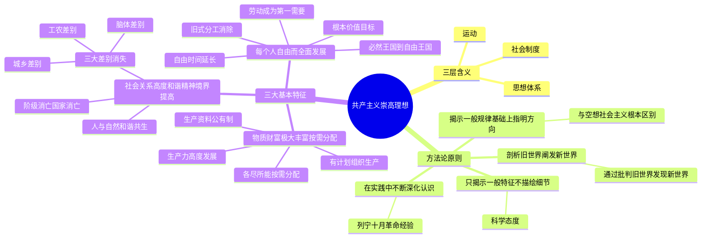

# 第七章 共产主义崇高理想及其最终实现

> source: 马克思主义基本原理（2023 年版）课件整理

---

## 一、展望未来共产主义新社会

### 1.1 "共产主义"的三层含义

❓ "共产主义"这个词有哪三层含义？

✅ **三层含义**：
1. **思想体系**——马克思主义关于共产主义的科学理论
2. **运动**——无产阶级和人民群众为实现共产主义而进行的实践活动
3. **社会制度**——人类社会发展的高级阶段，共产主义社会形态

---

### 1.2 预见未来社会的方法论原则

❓ 马克思主义预见未来社会的方法论原则有哪些？

✅ **四条基本原则**：

1. **在揭示人类社会发展一般规律的基础上指明社会发展的方向**
   - 这是马克思主义与**空想社会主义**的根本区别
   - 不是凭空想象，而是基于历史唯物主义和剩余价值学说

2. **在剖析资本主义旧世界的过程中阐发未来新世界的特点**
   - 核心名言：**"通过批判旧世界发现新世界"**
   - 从资本主义的内在矛盾中预见其必然灭亡与共产主义的必然胜利

3. **在社会主义社会发展中不断深化对未来社会的认识**
   - 实践基础：**列宁领导十月革命的实践经验**
   - 对未来的认识随社会主义实践的发展而不断深化

4. **立足于揭示未来社会的一般特征，不对细节作具体描绘**
   - 只揭示未来社会的基本方向和一般特征
   - 不陷入不切实际的空想——这是**科学态度**的体现

---

### 1.3 共产主义社会的基本特征

#### 特征一：物质财富极大丰富，消费资料按需分配

❓ 共产主义社会第一个基本特征是什么？

✅ **物质财富极大丰富，消费资料按需分配**，具体包括：

- **生产力高度发展**是必要条件和物质基础
- 实行**生产资料公有制**，消灭私有制
- **有计划地组织生产**，消除商品生产，个人劳动直接成为社会劳动的一部分
- 实现**"各尽所能，按需分配"**——突破按劳分配的历史局限，实现分配的真正平等

❓ 按需分配与按劳分配有何区别？

✅ **按劳分配**以劳动为尺度，仍存在事实上的不平等（等量劳动交换等价原则，默认了劳动者个人天赋和能力的天然特权）。**按需分配**以人的需要为尺度，实现了个人消费资料分配上的真正平等。

---

#### 特征二：社会关系高度和谐，精神境界极大提高

❓ 共产主义社会第二个基本特征是什么？

✅ **社会关系高度和谐，人们精神境界极大提高**，表现为：

- **阶级消亡、国家消亡**——国家将"放到古物陈列馆去，同纺车和青铜斧陈列在一起"（恩格斯语）
- **战争不复存在**——私有制和阶级消灭后，战争的社会根源消失
- **三大差别消失**：
  - 工业与农业的差别
  - 城市与乡村的差别
  - 脑力劳动与体力劳动的差别
- **人与自然和谐共生**——人类能合理调节与自然的物质变换
- **精神境界极大提高**——集体主义、为公共利益自觉献身成为普遍现象

---

#### 特征三：每个人自由而全面的发展，向自由王国飞跃

❓ 马克思主义追求的根本价值目标是什么？

✅ **每个人自由而全面的发展，人类从必然王国向自由王国飞跃**。这是马克思主义最根本的价值目标。

❓ 这一特征具体包含哪些内容？

✅ **六个要点**：

1. **马克思主义的根本价值目标**——每个人的自由全面发展
2. **旧式分工被消除**——人不再被奴役在固定的职业和活动范围中
3. **自由时间大大延长**——人们有充分的时间发展自己的兴趣和才能
4. **劳动成为"生活的第一需要"**——不再是谋生手段，劳动本身充满乐趣和创造性
5. **著名论断**：**"每个人的自由发展是一切人的自由发展的条件"**（《共产党宣言》）
6. **从必然王国到自由王国**——人类从受盲目规律支配的状态，进入自觉利用规律为自身服务的自由状态

---

## 思维导图

---

> **学习提示**：本章围绕"为何共产主义一定会实现"与"共产主义是何种社会形态"两个核心问题展开，理解三大基本特征之间的逻辑递进——物质基础（特征一）→ 社会条件（特征二）→ 人的解放（特征三），三者层层推进、有机统一。
